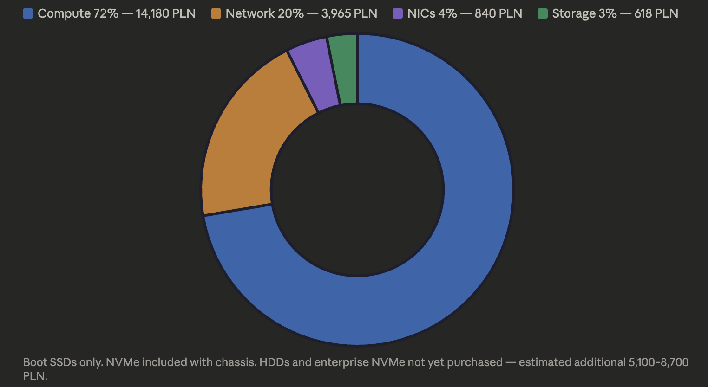

import Callout from '@/components/Callout.astro'

The [validation BOM](/blog/homelab-bom/pre-validation) covered one node and the network infrastructure — enough to prove the design works. This post covers what happened next: scaling to three nodes for Phase 1, every price change and hardware swap along the way, and the total cost of the cluster so far.

Validation exists to catch surprises before they get expensive. It caught several.

## What changed from the validation BOM

### NICs: three purchases, two returns

The NIC selection was the most expensive lesson. Covered in detail in the [hardware validation post](/blog/homelab-validation/hardware), but the cost impact belongs here:

| NIC | Price | Outcome |
|-----|-------|---------|
| Intel X710-DA2 | 299.00 PLN | POST hang in Dell 5090 SFF. Returned. |
| Mellanox ConnectX-3 CX312A | 289.90 PLN | mlx4_core driver removed from SCOS 10. Returned. |
| Mellanox ConnectX-4 Lx CX4121C | 279.99 PLN | Works. Kept. |

No money lost (all returned), but about a month of shipping and waiting. The CX4121C ended up being the cheapest of the three — and the only one that works.

For Nodes 5-6, bought two more CX4121C at the same price. No surprises the second time.

### RAM: buy now or pay more later

Node 4 came from the seller with 64 GB (2 x 32 GB DDR4-3200). Enough for validation. But DDR4 prices were climbing — global supply situation pushing modules from ~400 PLN to 850 PLN per 32 GB stick in a few months.

Decision: buy all RAM now. Upgraded Node 4 to 128 GB (added 2 x 32 GB at 850 PLN each), and ordered Nodes 5-6 with 128 GB from the start. Total RAM cost is higher than planned, but waiting would have been worse.

| Node | RAM config | How |
|------|-----------|-----|
| Node 4 | 64 GB → 128 GB | Bought 2 x 32 GB separately (1,700 PLN) |
| Node 5 | 128 GB | Included with chassis |
| Node 6 | 128 GB | Included with chassis |

### Boot SSD: Intel D3-S3610 price doubled

The D3-S3610 400 GB was 220 PLN for Node 4. By the time Nodes 5-6 were ordered, the same drive was going for ~440 PLN on Allegro. Not worth it at that price.

Replacement: **Toshiba THNSF8400CCSE 400 GB** — enterprise SATA SSD, 199 PLN each. Same enterprise endurance class, lower price than the now-inflated D3-S3610.

| Boot SSD | Node 4 | Nodes 5-6 |
|----------|--------|-----------|
| Model | Intel D3-S3610 400 GB | Toshiba THNSF8400CCSE 400 GB |
| Price | 220 PLN | 199 PLN each |
| Why | Available, good price | D3-S3610 price doubled |

Both are enterprise MLC/eMLC SSDs with high write endurance — what matters for etcd.

### NVMe: PNY CS1030 stays (for now)

The PNY CS1030 is DRAM-less and consumer-grade. Not ideal for a Ceph OSD. But after validation, the decision is: it works, Ceph isn't deployed yet, and enterprise NVMe can wait. No point spending on enterprise drives before Rook-Ceph is running and I can measure actual I/O patterns.

All three nodes use the seller-provided NVMe for now. Enterprise replacement comes when it matters.

### HDD: still deferred

HDDs are the most expensive per-node component and not needed until Rook-Ceph is deployed with a slow pool. Buying 3 x 20 TB drives to sit on a shelf while I'm still bootstrapping the cluster doesn't make sense. Purchased after the platform is running.

## Nodes 5-6: the Phase 1 purchase

Same seller on Allegro, same Dell OptiPlex 5090 SFF chassis. Different config — 128 GB RAM from the start and a 480 GB SSD included (used as the seller-provided NVMe, same role as Node 4's PNY CS1030).

| Component | Per node | Qty | Total |
|-----------|----------|-----|-------|
| Dell OptiPlex 5090 SFF (i7-11700, 128 GB, 480 GB SSD) | 4,560.00 PLN | 2 | 9,120.00 PLN |
| Toshiba THNSF8400CCSE 400 GB (boot SSD) | 199.00 PLN | 2 | 398.00 PLN |
| Mellanox CX4121C (Dell 20NJD) | 279.99 PLN | 2 | 559.98 PLN |
| DAC cable (1m) | 48.99 PLN | 1 | 48.99 PLN |
| **Subtotal (Nodes 5-6)** | | | **10,126.97 PLN** |

One new DAC cable — the validation setup already had enough for Node 4 and the trunk, but Nodes 5-6 need one more connection to the CRS317.

## Node 4 upgrade

| Component | Price |
|-----------|-------|
| RAM upgrade: 2 x 32 GB DDR4-3200 | 1,700.00 PLN |

Node 4 goes from 64 GB to 128 GB. All three nodes now identical at 128 GB.

## Complete Phase 1 BOM

Everything purchased across validation and Phase 1, in one table:

| Component | Detail | Qty | Unit price | Total | Condition |
|-----------|--------|-----|-----------|-------|-----------|
| **Compute** | | | | | |
| Node 4 chassis | Dell 5090 SFF, i7-11700, 64 GB, NVMe | 1 | 3,360.00 | 3,360.00 | Used |
| Node 4 RAM upgrade | 2 x 32 GB DDR4-3200 | 1 | 1,700.00 | 1,700.00 | New |
| Nodes 5-6 chassis | Dell 5090 SFF, i7-11700, 128 GB, 480 GB SSD | 2 | 4,560.00 | 9,120.00 | Used |
| **Storage** | | | | | |
| Boot SSD (Node 4) | Intel D3-S3610 400 GB | 1 | 220.00 | 220.00 | Used |
| Boot SSD (Nodes 5-6) | Toshiba THNSF8400CCSE 400 GB | 2 | 199.00 | 398.00 | Used |
| NVMe (all nodes) | Seller-provided (PNY CS1030 / 480 GB SSD) | 3 | — | — | Included |
| HDD | **Not purchased yet** | 0 | — | — | — |
| **Network — NICs** | | | | | |
| CX4121C (all nodes) | Mellanox ConnectX-4 Lx, Dell 20NJD | 3 | 279.99 | 839.97 | Used |
| **Network — infrastructure** | | | | | |
| Router | MikroTik CCR2004-16G-2S+PC | 1 | 1,549.91 | 1,549.91 | New |
| Switch | MikroTik CRS317-1G-16S+RM | 1 | 1,664.36 | 1,664.36 | New |
| SFP+ RJ45 module | ISP → router | 1 | 239.65 | 239.65 | New |
| SFP+ RJ45 module | Mac mini → switch | 1 | 214.60 | 214.60 | New |
| DAC 0.5m | Router ↔ switch trunk | 1 | 56.64 | 56.64 | New |
| DAC 1m x 2 | Switch ↔ Node 4 (validation) | 1 | 190.75 | 190.75 | New |
| DAC 1m | Switch ↔ Node 5 or 6 | 1 | 48.99 | 48.99 | New |
| | | | | | |
| **Total Phase 1** | | | | **19,602.87 PLN** | |
| **~EUR** | | | | **~4,559 EUR** | |

### What's not in the total

- **HDDs** — purchased after Rook-Ceph is deployed. Estimated 3 x ~1,500-2,500 PLN depending on capacity (16-24 TB). Adds ~4,500-7,500 PLN.
- **Enterprise NVMe** — replaces the seller-provided drives when Ceph performance data justifies it. Estimated 3 x ~200-400 PLN.
- **Returned NICs** — X710 (299 PLN) and CX312A (289.90 PLN) were refunded. No net cost, just time.

## Cost breakdown

Let's be honest — a homelab isn't a cheap hobby. ~19,600 PLN (~4,560 EUR) for three SFF desktops, networking gear, and enterprise boot SSDs. And that's before HDDs and enterprise NVMe — the full build will land somewhere around 25,000-28,000 PLN (~5,800-6,500 EUR). That's real money, and it's worth being transparent about it.

But as I wrote in the [first post of this series](/blog/homelab-why): this isn't Plex in a container. It's infrastructure that mirrors what I work with professionally — from physical cabling to storage class definitions. The skills transfer directly. A training course covering the same material costs more and teaches less.

| Category | Total | % of spend |
|----------|-------|------------|
| Compute (chassis + RAM) | 14,180.00 PLN | 72% |
| Storage (boot SSDs only) | 618.00 PLN | 3% |
| NICs | 839.97 PLN | 4% |
| Network infrastructure | 3,964.90 PLN | 20% (one-time) |
| **Total** | **19,602.87 PLN** | |

72% on compute is expected — the Dell chassis with i7-11700 and 128 GB RAM is the most expensive component. The network infrastructure (router + switch + modules + cables) is 20% but it's a one-time cost that serves Phase 1 and Phase 2 without changes.

<Callout title="Boot SSDs only" variant="note">
  NVMe included with chassis. HDDs and enterprise NVMe not yet purchased — estimated additional 5,100-8,700 PLN.
</Callout>

## Lessons about buying used hardware

**1. Prices change fast.** The D3-S3610 doubled in a few months. DDR4 32 GB modules went from ~400 to 850 PLN. If you know you need something, buy it when the price is right, not when you need it.

**2. Same seller, identical units.** All three chassis from the same Allegro seller. Identical BIOS versions, identical NVMe slots, identical PCIe behavior. Mixing sellers means mixing hardware revisions and potential compatibility surprises.

**3. Enterprise SSDs are commodity.** The Toshiba THNSF8400CCSE was cheaper than the Intel D3-S3610 and serves the same purpose. Don't get attached to a specific model — check what's available at the right price.

**4. NIC validation saves real money.** Three NICs tested, two returned. If I'd bought five X710s upfront, that's ~1,500 PLN in returns and weeks of delay. Buy one, test, then bulk order.

**5. Defer what you can.** HDDs and enterprise NVMe can wait. The cluster runs without them — Rook-Ceph isn't deployed until Phase 1 is stable. No point tying up capital in components that sit idle.

## What's still coming

| Component | When | Estimated cost |
|-----------|------|---------------|
| HDDs (3 x 16-24 TB) | After Rook-Ceph deployment | ~4,500-7,500 PLN |
| Enterprise NVMe (3x) | When Ceph I/O data justifies it | ~600-1,200 PLN |
| Nodes 7-8 (Phase 2) | After Phase 1 is stable | ~10,000+ PLN |

The cluster as it stands — three nodes with 128 GB RAM, 10G networking, enterprise boot SSDs, and validated NICs — is ready for Phase 1 deployment. Total investment so far: **~19,600 PLN (~4,560 EUR)**. With HDDs and enterprise NVMe still ahead, the full Phase 1 build will likely land around **~25,000-28,000 PLN (~5,800-6,500 EUR)**.

Not cheap. But cheaper than the knowledge it builds.
