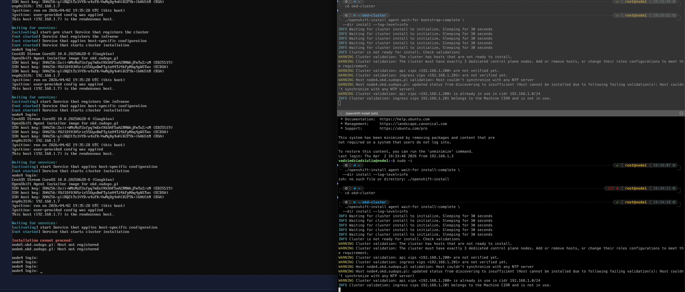
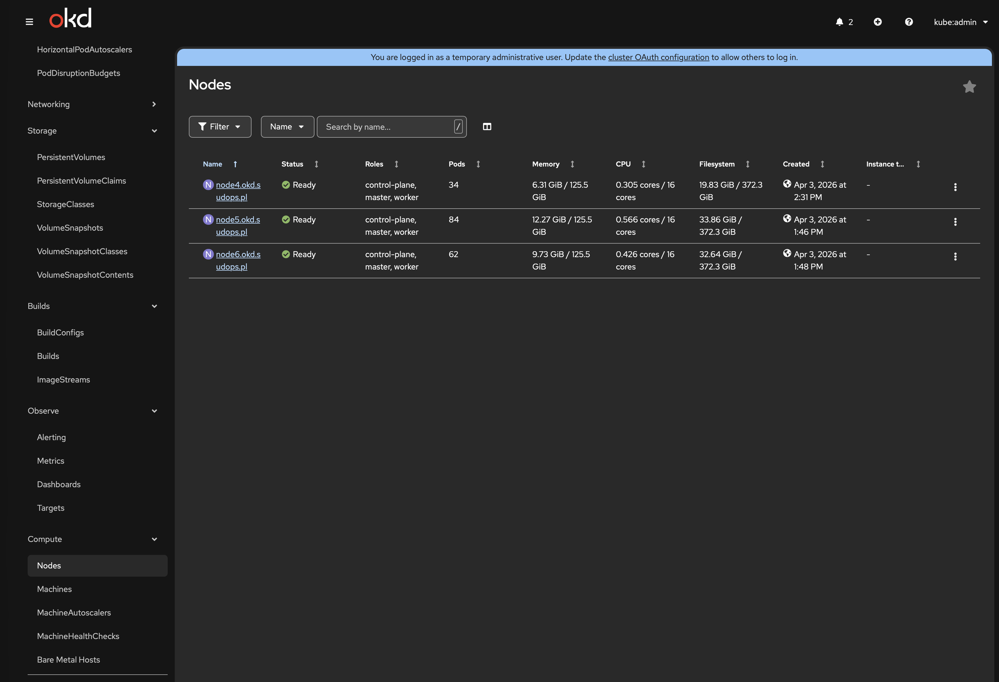

import Callout from '@/components/Callout.astro'

The hardware is [validated](/blog/homelab-validation/hardware). The single-node proof of concept [worked](/blog/homelab-validation/sno). Three identical Dell OptiPlex 5090 SFF machines are racked, cabled, and ready. Time to deploy the production cluster.

This post covers the 3-node OKD 4.20 compact cluster installation — the real one, not a validation throwaway. It took five attempts across two days. Every failure traced back to something that existed before the installer even ran.

## What changed from SNO

The SNO validation used `platform: none` on `home.lab` — a disposable test cluster on an internal-only domain. The 3-node deployment changes three fundamental things:

| | SNO (Stage 0) | 3-Node (Stage 1) |
|---|---|---|
| **Platform** | `platform: none` | `platform: baremetal` |
| **Domain** | `home.lab` | `sudops.pl` (real public domain) |
| **API/Ingress** | Bound to node IP (192.168.1.7) | Floating VIPs via keepalived |
| **Nodes** | 1 (combined everything) | 3 (compact: control-plane + worker) |

`platform: baremetal` is mandatory for multi-node agent-based installs in OKD 4.17+. The installer rejects `platform: none` with more than one control plane replica. The good news: this doesn't require BMC, IPMI, or Ironic. With the agent-based installer, you boot nodes manually from an ISO — `platform: baremetal` just means OKD deploys keepalived and haproxy static pods on every control plane node for VIP management.

Using `sudops.pl` instead of `home.lab` enables cert-manager with DNS-01 validation via Cloudflare API later. Browser-trusted wildcard certs for `*.apps.okd.sudops.pl` without managing a private CA. The split-horizon DNS is simple: Pi-hole forwards only `*.okd.sudops.pl` to the MikroTik router via a targeted dnsmasq directive, everything else goes to upstream DNS normally.

<Callout title="VIPs must live on VLAN 5" variant="warning">
  The original design placed API and Ingress VIPs on VLAN 40 (DMZ) at 192.168.40.253 and .254. This doesn't work — keepalived binds VIPs to the interface whose subnet matches the VIP address. Since nodes' primary interfaces are on 192.168.1.0/24 (VLAN 5), VIPs must also be on this subnet. The DMZ exposure plan is now DNAT rules on the MikroTik router.
</Callout>

## The install-config.yaml

```yaml
apiVersion: v1
baseDomain: sudops.pl
metadata:
  name: okd
compute:
  - architecture: amd64
    hyperthreading: Enabled
    name: worker
    replicas: 0                # Compact: masters are schedulable
controlPlane:
  architecture: amd64
  hyperthreading: Enabled
  name: master
  replicas: 3
networking:
  clusterNetwork:
    - cidr: 10.128.0.0/14
      hostPrefix: 23
  machineNetwork:
    - cidr: 192.168.1.0/24
  networkType: OVNKubernetes
  serviceNetwork:
    - 172.30.0.0/16
platform:
  baremetal:
    apiVIPs:
      - 192.168.1.240
    ingressVIPs:
      - 192.168.1.241
pullSecret: '<redacted>'
sshKey: '<redacted>'
```

`compute.replicas: 0` is the key — it makes all three masters schedulable as workers. The `machineNetwork` only includes VLAN 5. The storage network (VLAN 10) is invisible to Kubernetes — it's configured at the OS level post-install.

## The agent-config.yaml — simplified

The SNO agent-config had full NMState network definitions including Mellanox ports and VLAN sub-interfaces. For Stage 1, I stripped it down to just the onboard NIC:

```yaml
apiVersion: v1beta1
kind: AgentConfig
metadata:
  name: okd
rendezvousIP: 192.168.1.7
additionalNTPSources:
  - 192.168.1.1

hosts:
  - hostname: node4.okd.sudops.pl
    role: master
    rootDeviceHints:
      deviceName: "/dev/sda"
    interfaces:
      - name: eno1
        macAddress: "<node4-mac>"
    networkConfig:
      interfaces:
        - name: eno1
          type: ethernet
          state: up
          ipv4:
            enabled: true
            dhcp: false
            address:
              - ip: 192.168.1.7
                prefix-length: 24
          ipv6:
            enabled: false
      dns-resolver:
        config:
          server:
            - 192.168.1.12
      routes:
        config:
          - destination: 0.0.0.0/0
            next-hop-address: 192.168.1.1
            next-hop-interface: eno1
            table-id: 254
  # Node 5 and 6: identical structure, different IPs (.8 and .9)
```

No Mellanox config, no bonds, no VLAN sub-interfaces. The storage network is a day-2 operation — apply NMState NNCPs after the cluster is healthy. If a bond config has a typo in agent-config, you regenerate the ISO and reinstall from scratch. With day-2 NNCPs, you edit the YAML and reapply — NMState rolls back automatically on failure.

## Attempt 1: the VIP that wasn't free

First ISO generated, all three nodes booted via JetKVM, Node 4 starts the Assisted Service as the rendezvous host. The monitoring output:

```
WARNING Cluster validation: api vips <192.168.1.200> is already in use in cidr 192.168.1.0/24
```

The original VIPs were .200 and .201. Something already owns .200.

My first thought was the CRS317 switch — its management IP was 192.168.1.200 from the Stage 0 network config. But I checked: the CRS317 management is at .220, unchanged. The actual owner: **Node 1** — the old vanilla Kubernetes cluster that's still running. Its API VIP is 192.168.1.200. And it can't be shut down — it's still serving workloads.

New VIPs: 192.168.1.240 (API) and 192.168.1.241 (Ingress). ISO regenerated.



## Attempt 2: the NTP nobody configured

Second ISO, same three nodes rebooted. New error:

```
WARNING Host node4.okd.sudops.pl validation: Host couldn't synchronize with any NTP server
WARNING Host node4.okd.sudops.pl: updated status from discovering to insufficient
```

The agent-config references `additionalNTPSources: 192.168.1.1` — the MikroTik CCR2004 router. Which was never configured as an NTP server. It syncs its own clock (NTP client enabled), but it wasn't serving time to LAN clients.

```routeros
/system ntp server set enabled=yes
```

One command. The validation re-runs every 30 seconds — no reboot needed. Within a minute:

```
INFO Host node4.okd.sudops.pl validation: Host NTP is synced
INFO Host node4.okd.sudops.pl: validation 'ntp-synced' is now fixed
```

## Attempt 1 (continued): the x509 certificate that revealed the DNS chain

Still on the first attempt with VIPs at .200/.201 — the Assisted Service flagged the VIP collision, but the `openshift-install` monitoring binary on my bastion showed something else entirely:

```
ERROR tls: failed to verify certificate: x509: certificate is valid for
  kube-cp.homelab.net, kubernetes, kubernetes.default, [...] node1,
  not api.okd.sudops.pl
```

Read that SAN list: `kube-cp.homelab.net`, `node1`. That's the old vanilla Kubernetes cluster. The monitoring binary connects to `api.okd.sudops.pl:6443`, which resolves to .200 — the old k8s VIP — because that's what the DNS records say.

At this point two things needed fixing: the VIP collision *and* the DNS chain. New VIPs: 192.168.1.240 and .241. Updated MikroTik static DNS. But that's not enough — **Pi-hole caches DNS responses**, and it was still serving the old .200 address from cache.

```bash
# On Pi-hole
pihole restartdns
```

Without flushing the Pi-hole cache, the bastion keeps resolving `api.okd.sudops.pl` to .200 no matter what the router says. This is the second time the Pi-hole DNS chain caught me — [the first was during SNO](/blog/homelab-validation/sno).

## The boot strategy problem: one JetKVM, three nodes

All three nodes must boot the agent ISO and register with the rendezvous host before installation starts. You can't bootstrap with one node and join the others later — the Assisted Service waits for the full count defined in agent-config.yaml.

I have one JetKVM. My initial plan: boot Node 4 from the ISO via JetKVM, let it start the Assisted Service, then move the JetKVM to Node 5, boot it, move to Node 6, boot it. Like I'd do with a vanilla Kubernetes cluster — init the first node, then `kubeadm join` the others.

That doesn't work. The agent-based installer isn't `kubeadm join`. All three nodes need to be booting the ISO simultaneously. Moving the JetKVM between nodes means the first node's ISO boot finishes and reboots before the third node even starts.

Second idea: boot Node 4 from JetKVM, then quickly unplug and replug the JetKVM to each subsequent node. I thought once a node wrote the image to disk, it was done — just needed the other nodes to register. But the Assisted Service on the rendezvous host needs all three in the discovery phase at the same time.

**The solution that worked:** JetKVM for Node 4 (rendezvous host), USB sticks with the agent ISO for Nodes 5 and 6. Boot all three within a few minutes of each other. Node 4 via JetKVM virtual media mount, Nodes 5 and 6 from physical USB — select boot device in BIOS and go.

```bash
# Write agent ISO to two USB sticks
sudo dd if=install/agent.x86_64.iso of=/dev/sdb bs=4M status=progress
sudo dd if=install/agent.x86_64.iso of=/dev/sdc bs=4M status=progress
```

Within 10 minutes, all three nodes were in the discovery phase. The Assisted Service validated NTP, connectivity, and VIP availability, then started the install automatically.

## Attempt 3: "Cannot access Rendezvous Host"

With the boot strategy sorted, the next run hit this in the monitoring output:

```
INFO Cannot access Rendezvous Host. There may be a network configuration problem
```

This appeared because the rendezvous host (Node 4) had already rebooted from the live ISO into the installed SCOS. The Assisted Service REST API that the monitoring binary polls no longer exists — it's a bootstrap-phase service only. The message is misleading. After a few minutes, the monitor switched from polling the Assisted Service to polling the Kubernetes API:

```
INFO Bootstrap Kube API Initialized
INFO Bootstrap configMap status is complete
INFO Bootstrap is complete
```

## Attempts 4 and 5: patience

The `wait-for-install-complete` command timed out twice more — not because anything was broken, but because operators take time to converge. The ingress controller needs router pods scheduled. The authentication operator waits for ingress. The console waits for authentication. The monitoring stack rolls out in parallel. On a 3-node cluster with 1GbE management network, the full operator convergence takes about 90 minutes.

The fourth attempt showed operators mid-convergence:

```
ERROR Cluster operator authentication Available is False
ERROR Cluster operator ingress Available is False
INFO Cluster operator kube-apiserver Progressing is True
INFO Cluster operator monitoring Progressing is True with RollOutInProgress
```

The fifth `wait-for-install-complete` — launched about 30 minutes after attempt 4 timed out — finally caught everything in the green:

```
INFO All cluster operators have completed progressing
INFO Checking to see if there is a route at openshift-console/console...
INFO Install complete!
INFO Access the OpenShift web-console here: https://console-openshift-console.apps.okd.sudops.pl
INFO Login to the console with user: "kubeadmin", and password: "XDjCj-XZL5s-7tadM-j7oa3"
```



## Validation

Three nodes, all Ready, correct roles:

```
NAME                  STATUS   ROLES                         AGE     VERSION
node4.okd.sudops.pl   Ready    control-plane,master,worker   4h30m   v1.33.5
node5.okd.sudops.pl   Ready    control-plane,master,worker   5h15m   v1.33.5
node6.okd.sudops.pl   Ready    control-plane,master,worker   5h14m   v1.33.5
```

etcd: three members, all healthy, one leader:

```
+------------------+---------+---------------------+--------------------------+
|        ID        | STATUS  |        NAME         |        PEER ADDRS        |
+------------------+---------+---------------------+--------------------------+
| 3b44327cc0e2ef7c | started | node4.okd.sudops.pl | https://192.168.1.7:2380 |
| 4e9edf2c412cd00b | started | node6.okd.sudops.pl | https://192.168.1.9:2380 |
| 7d2314c5333c189a | started | node5.okd.sudops.pl | https://192.168.1.8:2380 |
+------------------+---------+---------------------+--------------------------+
```

All 34 cluster operators: Available=True, Progressing=False, Degraded=False. Zero exceptions.

VIP failover: Node 5 holds the API VIP. Draining it moved the VIP to another node within seconds — `oc get nodes` still works. Uncordoned, VIP moved back.

## The split-horizon DNS gotcha

With `sudops.pl` as the baseDomain, Pi-hole needs to know that `*.okd.sudops.pl` should go to the router, not upstream DNS. But you can't just forward all of `sudops.pl` — that breaks the public blog and Cloudflare records.

The fix is a targeted dnsmasq directive that forwards only the OKD subdomain:

```bash
echo "server=/okd.sudops.pl/192.168.1.1" | sudo tee /etc/dnsmasq.d/10-okd-sudops.conf
pihole restartdns
```

`api.okd.sudops.pl` → router → 192.168.1.240. `sudops.pl` → upstream DNS → Cloudflare. Each query goes where it should.

## What I'd do differently

**Check VIP availability before generating the ISO.** A simple `arping 192.168.1.200` would have caught the Node 1 conflict before the first boot. Instead, I found out from the Assisted Service validation 10 minutes into the install.

**Flush Pi-hole cache every time DNS records change.** Updating the router's static DNS is only half the fix. Pi-hole caches responses — if it cached the old .200 address, it keeps serving it until the cache expires or you force a flush with `pihole restartdns`. This is the same lesson from SNO, and I still forgot it.

**Enable NTP on the router during network setup, not during OKD install.** The NTP server should have been part of the CCR2004 config in the network implementation post. It's a one-line command — there's no reason to discover it's missing during a cluster install.

**Plan the multi-node boot strategy before starting.** One JetKVM can't boot three nodes simultaneously. The agent-based installer needs all hosts in discovery at the same time — this isn't `kubeadm join`. Have USB sticks ready, or use HTTP-served ISOs if your JetKVM firmware supports virtual media mount.

**Don't panic when `wait-for-install-complete` times out.** The 60-minute timeout for the monitoring binary is aggressive for a 3-node compact cluster where operators are still converging. If bootstrap completed and `oc get co` shows operators progressing (not degraded), just wait. Re-run the command.

## Timeline

| Time | Event |
|------|-------|
| Apr 2, 19:35 | Attempt 1: VIP .200 conflict with old k8s cluster. x509 cert reveals DNS pointing at wrong API |
| Apr 2, ~20:00 | Fix: new VIPs (.240/.241), update router DNS, flush Pi-hole cache, flush Mac DNS |
| Apr 2, 21:10 | New ISO generated with corrected VIPs |
| Apr 2, 21:45 | Attempt 2: NTP failure → enable NTP server on CCR2004 → fixed in 1 minute |
| Apr 2, ~22:00 | Boot strategy problem: single JetKVM can't boot 3 nodes simultaneously |
| Apr 2, ~22:30 | Solution: JetKVM for Node 4, USB sticks for Nodes 5+6 |
| Apr 3, 09:20 | Attempt 3: "Cannot access Rendezvous Host" (misleading — just transition from agent to kube API) |
| Apr 3, 10:44 | Bootstrap complete confirmed |
| Apr 3, 11:20 | Attempt 4: operators still converging, timeout |
| Apr 3, 12:20 | Attempt 5: authentication/ingress/monitoring still progressing, timeout |
| Apr 3, 12:59 | **Install complete.** All 34 operators green. |
| Apr 3, 15:52 | Validation: 3 nodes Ready, etcd healthy, console accessible |

Total wall-clock time from first boot to "Install complete!": about 17 hours. Actual installer run time on the successful attempt: about 90 minutes. The rest was debugging things that should have been right before the ISO was generated.

## What's next

The cluster runs on onboard 1GbE NICs only. Each node has a Mellanox CX4121C with dual 10GbE SFP28 ports sitting idle, waiting for the storage network. Next:

1. **GitOps** — ArgoCD via the [okderators catalog](https://github.com/okd-project/okderators-catalog-index), so everything from here on is declarative
2. **Storage network** — NMState NNCPs to configure the 10GbE Mellanox ports on VLAN 10
3. **Rook-Ceph** — NVMe fast pool with replica-3 across all three nodes
4. **LACP bonds** — second Mellanox port added for redundancy (day-2 operation, not a reinstall)

The cluster is running. The hard part isn't the installer — it's everything around it.
