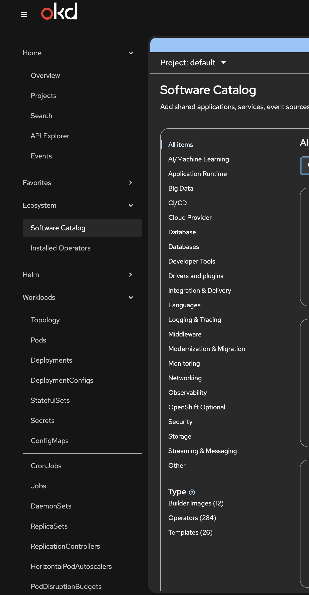
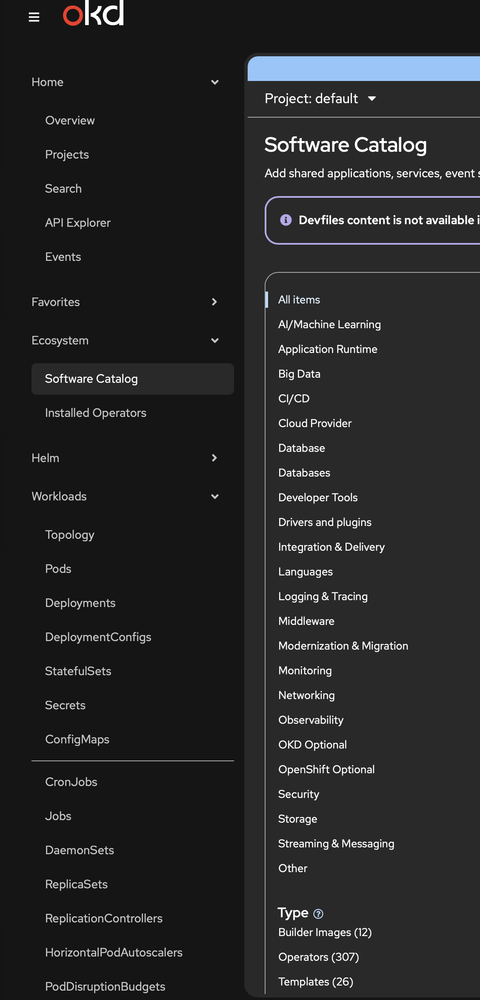
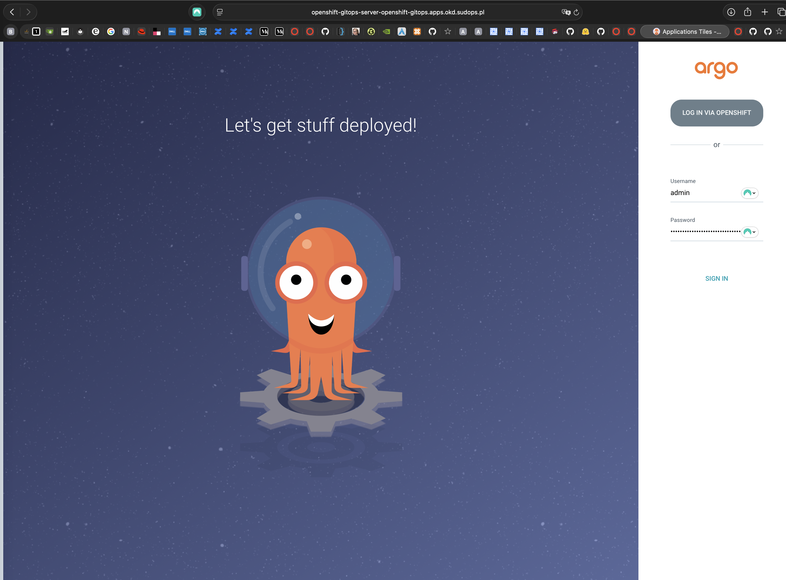
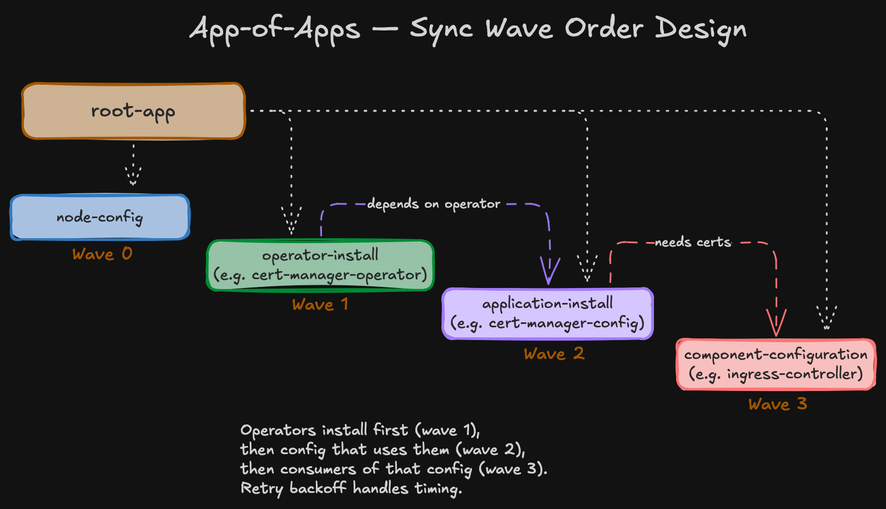

import Callout from '@/components/Callout.astro'

The [3-node cluster](/blog/homelab-day1) is running. Before touching storage, networking, or any operator, the management layer goes in. Everything from here on should flow through Git — commit, push, ArgoCD syncs, done.

## The operator source: OKDerators

OKD ships with `community-operators` — the OperatorHub.io catalog built for vanilla Kubernetes. For OKD-native operators, there's [OKDerators](https://github.com/okd-project/okderators-catalog-index) — built and tested for OKD/SCOS, maintained by the OKD working group. The plan from the start: use OKDerators for everything it provides.

```yaml
apiVersion: operators.coreos.com/v1alpha1
kind: CatalogSource
metadata:
  name: okderators
  namespace: openshift-marketplace
spec:
  sourceType: grpc
  image: quay.io/okderators/catalog-index:4.20
  displayName: OKDerators
  publisher: OKD Community
  updateStrategy:
    registryPoll:
      interval: 60m
```

The Software Catalog jumps from 284 to 307 operators:





## GitOps operator

```yaml
apiVersion: operators.coreos.com/v1alpha1
kind: Subscription
metadata:
  name: gitops-operator
  namespace: openshift-operators
spec:
  channel: alpha
  installPlanApproval: Automatic
  name: gitops-operator
  source: okderators
  sourceNamespace: openshift-marketplace
```

Auto-provisions `openshift-gitops` namespace, a cluster-scoped ArgoCD instance, a Route, and the console plugin.

```bash
oc get route openshift-gitops-server -n openshift-gitops -o jsonpath='{.spec.host}'
# openshift-gitops-server-openshift-gitops.apps.okd.sudops.pl

oc get secret openshift-gitops-cluster -n openshift-gitops \
  -o jsonpath='{.data.admin\.password}' | base64 -d && echo
```



### RBAC

The operator may not auto-grant `cluster-admin` to the ArgoCD service accounts. Without it, ArgoCD can't create CRDs, namespaces, or ClusterRoles:

```yaml
apiVersion: rbac.authorization.k8s.io/v1
kind: ClusterRoleBinding
metadata:
  name: openshift-gitops-cluster-admin
roleRef:
  apiGroup: rbac.authorization.k8s.io
  kind: ClusterRole
  name: cluster-admin
subjects:
  - kind: ServiceAccount
    name: openshift-gitops-argocd-application-controller
    namespace: openshift-gitops
  - kind: ServiceAccount
    name: openshift-gitops-argocd-server
    namespace: openshift-gitops
```

<Callout title="cluster-admin is broad, and that's fine here" variant="note">
  Yeah, `cluster-admin` is broad. It's a homelab — I'm the only user, and the Git repo is the real access control. If you can push to `master`, you own the cluster. For a team setup, scope this down.
</Callout>

## Connect the Git repo

Private repo at `github.com/sudoom/homelab`. Deploy key for read-only SSH access:

```bash
ssh-keygen -t ed25519 -f ~/.ssh/argocd-homelab -C "argocd-deploy-key" -N ""
```

Add the public key in GitHub (Settings → Deploy Keys), then create the Secret:

```bash
KEY_B64=$(base64 -w0 < ~/.ssh/argocd-homelab)
URL_B64=$(echo -n 'git@github.com:sudoom/homelab.git' | base64 -w0)
TYPE_B64=$(echo -n 'git' | base64 -w0)

cat <<EOF | oc apply -f -
apiVersion: v1
kind: Secret
metadata:
  name: repo-creds
  namespace: openshift-gitops
  labels:
    argocd.argoproj.io/secret-type: repo-creds
type: Opaque
data:
  type: ${TYPE_B64}
  url: ${URL_B64}
  sshPrivateKey: ${KEY_B64}
EOF
```

## Repo structure

App-of-Apps pattern with Helm charts. At bootstrap, it's mostly a skeleton:

```
homelab/
  bootstrap/
    phase0/                          # Manual (applied once)
    root-app/                        # Root Application (Helm)
      Chart.yaml
      values.yaml
      templates/applications.yaml
  components/                        # One chart per component
    cluster-config/node-labels/
    operators/nmstate/
    operators/cert-manager/
    operators/rook-ceph/
    ...
```

## The template

The root Application renders one ArgoCD Application per enabled entry:

```yaml
{`{{- range $name, $app := .Values.applications }}
{{- if $app.enabled }}
---
apiVersion: argoproj.io/v1alpha1
kind: Application
metadata:
  name: {{ $name }}
  namespace: {{ $.Values.global.argocdNamespace }}
  annotations:
    argocd.argoproj.io/sync-wave: {{ $app.syncWave | quote }}
  finalizers:
    - resources-finalizer.argocd.argoproj.io
spec:
  project: default
  source:
    repoURL: {{ $.Values.global.repoURL }}
    targetRevision: {{ $.Values.global.targetRevision }}
    path: {{ $app.path }}
    helm:
      valueFiles:
        - values.yaml
  destination:
    server: {{ $.Values.global.clusterURL }}
    namespace: {{ $app.namespace }}
  syncPolicy:
    automated:
      prune: true
      selfHeal: true
    syncOptions:
      - ServerSideApply=true
      - RespectIgnoreDifferences=true
      - SkipDryRunOnMissingResource=true
    retry:
      limit: 5
      backoff:
        duration: 5s
        factor: 2
        maxDuration: 3m
{{- end }}
{{- end }}`}
```

Every syncPolicy option earns its place:

- **`prune: true`** — remove a manifest from Git, ArgoCD deletes it from the cluster. Git is the source of truth.
- **`selfHeal: true`** — manual cluster edits get reverted to match Git. No drift.
- **No `CreateNamespace=true`.** Each component chart includes an explicit `Namespace` resource — full control over labels, annotations, pod security settings.
- **`ServerSideApply=true`** — avoids the 262 KB annotation limit that kills client-side apply on large operator CRDs.
- **`RespectIgnoreDifferences=true`** — stops ArgoCD from fighting operators that patch their own resources.
- **`SkipDryRunOnMissingResource=true`** — lets CRs sync before their CRDs are registered. Retry handles the timing.
- **Retry backoff** — 5 retries, 5s → 10s → 20s → 40s → 80s. Bridges the gap between operator install and CRD availability.

## The first app: node labels

The simplest component — failure domain labels from the [compute design](/blog/homelab-design/compute):

```yaml
# components/cluster-config/node-labels/values.yaml
nodes:
  - hostname: node4.okd.sudops.pl
    labels:
      topology.kubernetes.io/zone: fd-a
  - hostname: node5.okd.sudops.pl
    labels:
      topology.kubernetes.io/zone: fd-b
  - hostname: node6.okd.sudops.pl
    labels:
      topology.kubernetes.io/zone: fd-c
```

```yaml
# components/cluster-config/node-labels/templates/node-labels.yaml
{`{{- range .Values.nodes }}
---
apiVersion: v1
kind: Node
metadata:
  name: {{ .hostname }}
  labels:
    {{- range $key, $value := .labels }}
    {{ $key }}: {{ $value | quote }}
    {{- end }}
{{- end }}`}
```

At bootstrap time, this is the only enabled app in `values.yaml`:

```yaml
# bootstrap/root-app/values.yaml (bootstrap state)
global:
  repoURL: git@github.com:sudoom/homelab.git
  targetRevision: master
  argocdNamespace: openshift-gitops
  clusterURL: https://kubernetes.default.svc

applications:
  node-labels:
    enabled: true
    path: components/cluster-config/node-labels
    namespace: default
    syncWave: "0"

  # Remaining components enabled as Day 2 subposts progress:
  # nmstate-operator, cert-manager-operator, rook-ceph-operator (wave 1)
  # nmstate-nncp, cert-manager-config (wave 2)
  # ingress-controller, api-server (wave 3)
  # ceph-cluster, ceph-storage-classes (wave 3-4)
```



## Apply the root Application

Last manual `oc apply`:

```bash
oc apply -f bootstrap/phase0/05_root_application.yaml
```

ArgoCD picks it up, renders `node-labels`, labels all three nodes. One app running, the rest enabled as each Day 2 subpost is written.

## Five manual commands, then Git

```bash
oc apply -f bootstrap/phase0/01_catalog_source.yaml
oc apply -f bootstrap/phase0/02_gitops_operator.yaml
oc apply -f bootstrap/phase0/03_cluster_admin_rbac.yaml
oc apply -f bootstrap/phase0/04_credential_template.yaml
oc apply -f bootstrap/phase0/05_root_application.yaml
```

After that: create a chart, add to `values.yaml`, commit, push. No `oc apply`, no `helm install`. If something breaks, `git revert`.

Next: [cert-manager](/blog/homelab-day2/cert-manager) — first component deployed entirely through this pipeline.
