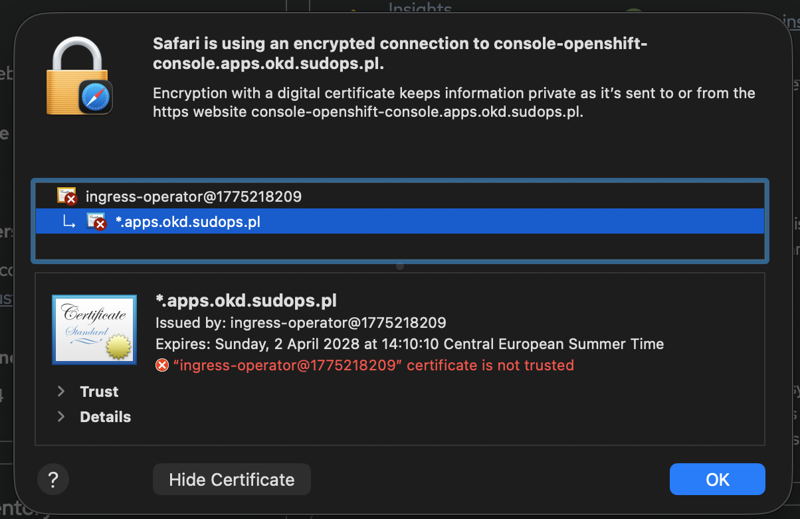
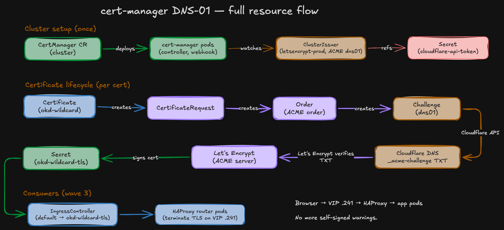
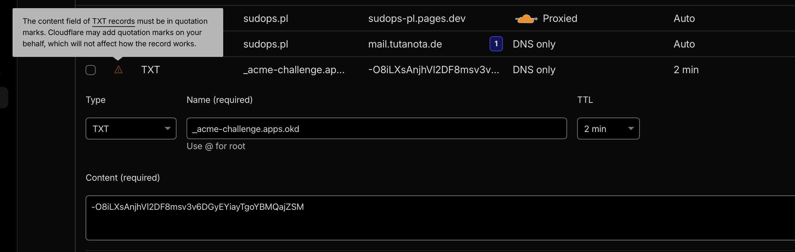
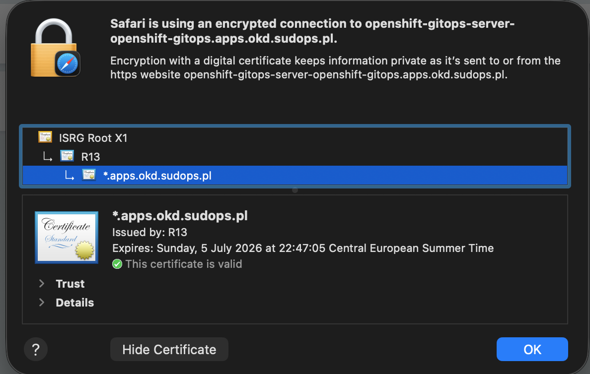
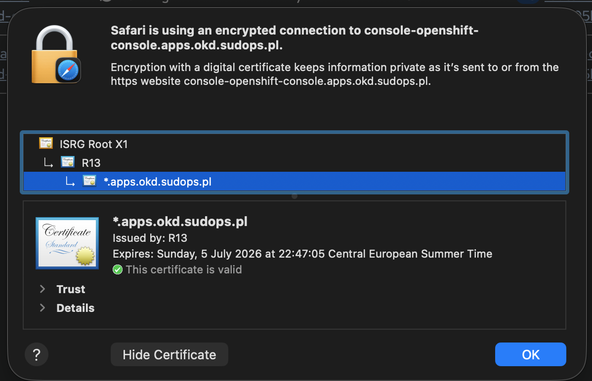

import Callout from '@/components/Callout.astro'

The [bootstrap](/blog/homelab-day2/bootstrap) is done — ArgoCD manages the cluster from Git. This is the first component deployed entirely through the pipeline: cert-manager with Let's Encrypt certificates via Cloudflare DNS-01 validation.

The goal: replace the self-signed ingress certificates with browser-trusted wildcards. No more "Your connection is not private" on every console login.



## How DNS-01 works

cert-manager automates TLS certificate issuance from Let's Encrypt using the ACME protocol. The DNS-01 challenge proves domain ownership by creating a TXT record in public DNS. But there's a full chain of Kubernetes resources behind it:

**Cluster setup (once):**
- `CertManager` CR deploys the cert-manager pods (controller, webhook, cainjector)
- `ClusterIssuer` defines the ACME server (Let's Encrypt) and solver (Cloudflare DNS-01)
- `Secret` holds the Cloudflare API token that the issuer references

**Certificate lifecycle (per cert):**
1. You create a `Certificate` resource (e.g., `okd-wildcard` for `*.apps.okd.sudops.pl`)
2. cert-manager creates a `CertificateRequest` — the internal representation of "I need this cert signed"
3. The issuer creates an `Order` — an ACME order with Let's Encrypt
4. The order creates a `Challenge` — the DNS-01 proof-of-ownership task
5. The challenge controller uses the Cloudflare API to create a `_acme-challenge.apps.okd` TXT record
6. Let's Encrypt queries public DNS, finds the token, confirms ownership
7. Let's Encrypt issues the signed certificate
8. cert-manager stores it in a Kubernetes `Secret` (`okd-wildcard-tls`)
9. cert-manager cleans up the TXT record and auto-renews before expiry

You can watch the whole chain in real time: `oc get certificate,certificaterequest,order,challenge -A`

DNS-01 is the only ACME challenge type that supports **wildcard certificates**. HTTP-01 (the alternative) requires Let's Encrypt to reach your cluster on port 80 — not practical behind NAT without port forwarding.



## What is an ingress controller?

Vanilla Kubernetes doesn't ship an ingress controller — you pick one (nginx, Traefik, HAProxy). OKD ships one by default: an HAProxy-based router managed by the `IngressController` CR. It runs as pods on every control-plane node, listens on the Ingress VIP (192.168.1.241 via keepalived), terminates TLS, and forwards traffic to backend Services based on Route/Ingress rules.

When you open `console-openshift-console.apps.okd.sudops.pl` in a browser, the request hits the Ingress VIP, gets routed to an HAProxy router pod, the pod terminates TLS using whatever certificate is configured, then proxies the request to the console pod. The `defaultCertificate` on the IngressController CR controls which TLS cert the router uses. By default it's self-signed. I'm replacing it with the Let's Encrypt wildcard.

## What gets deployed

Four components enabled in `values.yaml`, across three sync waves:

| Wave | Component | What it does |
|------|-----------|-------------|
| 1 | `cert-manager-operator` | Installs cert-manager from OKDerators |
| 2 | `cert-manager-config` | ClusterIssuer + Certificate resources |
| 3 | `ingress-controller` | Patches default ingress to use the wildcard cert |
| 3 | `api-server` | Patches API server to use the API cert |

## Wave 1: the operator

The cert-manager operator chart creates the namespace, OperatorGroup, Subscription, and the `CertManager` CR:

```yaml
# components/operators/cert-manager/values.yaml
namespace: cert-manager-operator
channel: alpha
source: okderators
sourceNamespace: openshift-marketplace
```

The `CertManager` CR has one important override:

```yaml
apiVersion: operator.openshift.io/v1alpha1
kind: CertManager
metadata:
  name: cluster
spec:
  controllerConfig:
    overrideArgs:
      - "--dns01-recursive-nameservers=1.1.1.1:53,8.8.8.8:53"
      - "--dns01-recursive-nameservers-only"
```

Without `--dns01-recursive-nameservers-only`, cert-manager uses the cluster's DNS (Pi-hole, then the router via conditional forwarding). The ACME challenge TXT record lives on Cloudflare's public DNS, not on the local resolver. If cert-manager queries Pi-hole for `_acme-challenge.apps.okd.sudops.pl`, Pi-hole forwards to the router (which doesn't have the TXT record), and the challenge fails. Forcing Cloudflare (1.1.1.1) and Google (8.8.8.8) as recursive nameservers ensures cert-manager always checks public DNS for the challenge.

## The one manual step: Cloudflare API token

cert-manager needs a Cloudflare API token to create DNS-01 challenge TXT records. This secret can't live in Git (it's a credential), so it's the one manual step outside the pipeline:

```bash
oc create secret generic cloudflare-api-token \
  -n cert-manager \
  --from-literal=api-token=<your-cloudflare-api-token>
```

The token needs `Zone:DNS:Edit` permission for `sudops.pl`. Create it in the Cloudflare dashboard under My Profile → API Tokens → Create Token → Edit zone DNS.

## Wave 2: ClusterIssuer and Certificates

The config chart creates a Let's Encrypt ClusterIssuer and two Certificate resources:

```yaml
# components/cluster-config/cert-manager-config/values.yaml
email: "submenu.prow-1o@icloud.com"
cloudflare:
  secretName: cloudflare-api-token
  secretKey: api-token

certificates:
  - name: okd-wildcard
    namespace: openshift-ingress
    secretName: okd-wildcard-tls
    dnsNames:
      - "*.apps.okd.sudops.pl"
      - "apps.okd.sudops.pl"
  - name: api-cert
    namespace: openshift-config
    secretName: api-cert-tls
    dnsNames:
      - "api.okd.sudops.pl"
```

Two certificates:

**`okd-wildcard`** — covers `*.apps.okd.sudops.pl` and `apps.okd.sudops.pl`. Goes into `openshift-ingress` namespace as `okd-wildcard-tls`. Every route in the cluster (console, ArgoCD, Grafana, any app) gets a trusted cert automatically.

**`api-cert`** — covers `api.okd.sudops.pl`. Goes into `openshift-config` as `api-cert-tls`. The Kubernetes API server uses this so `oc login` doesn't complain about certificate validation.

The ClusterIssuer uses ACME with Cloudflare DNS-01:

```yaml
{`apiVersion: cert-manager.io/v1
kind: ClusterIssuer
metadata:
  name: letsencrypt-prod
spec:
  acme:
    server: https://acme-v02.api.letsencrypt.org/directory
    email: {{ .Values.email }}
    privateKeySecretRef:
      name: letsencrypt-prod-account-key
    solvers:
      - dns01:
          cloudflare:
            apiTokenSecretRef:
              name: {{ .Values.cloudflare.secretName }}
              key: {{ .Values.cloudflare.secretKey }}`}
```

When cert-manager processes a Certificate, it creates a TXT record on Cloudflare, Let's Encrypt verifies it, issues the cert, and cert-manager stores it in the specified Secret. Automatic renewal before expiry.



## Wave 3: consuming the certs

Two patches, both in wave 3 (after certificates are issued):

**Ingress controller** — tells the default ingress to use the wildcard cert instead of the self-signed one:

```yaml
apiVersion: operator.openshift.io/v1
kind: IngressController
metadata:
  name: default
  namespace: openshift-ingress-operator
spec:
  defaultCertificate:
    name: okd-wildcard-tls
```

**API server** — adds the API cert as a named certificate:

```yaml
apiVersion: config.openshift.io/v1
kind: APIServer
metadata:
  name: cluster
spec:
  servingCerts:
    namedCertificates:
      - names:
          - api.okd.sudops.pl
        servingCertificate:
          name: api-cert-tls
```

<Callout title="API server patch triggers a rolling restart" variant="warning">
  The API server patch rolls kube-apiserver on all three nodes sequentially. `oc` commands may briefly fail during the rollout — wait for `oc get co kube-apiserver` to show `PROGRESSING=False`.
</Callout>

### Verify the API cert

`curl -vk https://api.okd.sudops.pl:6443` against the control-plane VIP, before and after. Before the patch, the serving cert is the default kube-apiserver-lb-signer:

```
* Server certificate:
*  subject: CN=api.okd.sudops.pl
*  issuer: OU=openshift; CN=kube-apiserver-lb-signer
*  SSL certificate verify result: self signed certificate in certificate chain (19), continuing anyway.
```

After ArgoCD syncs wave 3 and kube-apiserver finishes rolling:

```
* Server certificate:
*  subject: CN=api.okd.sudops.pl
*  issuer: C=US; O=Let's Encrypt; CN=R12
*  SSL certificate verify ok.
```

Same VIP, same port, new chain. `oc login` no longer needs `--insecure-skip-tls-verify`.

## The result

After ArgoCD syncs all three waves, every `*.apps.okd.sudops.pl` route serves a Let's Encrypt certificate. ISRG Root X1 → R13 → `*.apps.okd.sudops.pl`. Browser-trusted, auto-renewing.





No more clicking through certificate warnings. No private CA to distribute to devices. Let's Encrypt does the work, cert-manager automates it, ArgoCD manages the config.

## What was committed

Four entries added to `bootstrap/root-app/values.yaml`:

```yaml
cert-manager-operator:
  enabled: true
  path: components/operators/cert-manager
  namespace: cert-manager-operator
  syncWave: "1"

cert-manager-config:
  enabled: true
  path: components/cluster-config/cert-manager-config
  namespace: cert-manager
  syncWave: "2"

ingress-controller:
  enabled: true
  path: components/cluster-config/ingress-controller
  namespace: openshift-ingress-operator
  syncWave: "3"

api-server:
  enabled: true
  path: components/cluster-config/api-server
  namespace: openshift-config
  syncWave: "3"
```

One `git push`. ArgoCD synced all four. The only thing outside Git is the Cloudflare API token Secret.

Next: storage network — NMState NNCPs for the 10GbE Mellanox ports. *(coming soon)*
