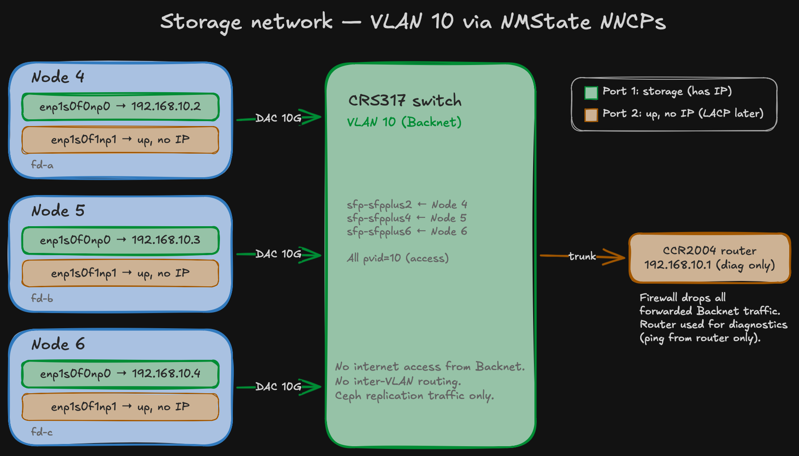

import Callout from '@/components/Callout.astro'

The [bootstrap](/blog/homelab-day2/bootstrap) deployed ArgoCD and [cert-manager](/blog/homelab-day2/cert-manager) gave me trusted TLS. The cluster is still running on the onboard 1GbE NICs only. Each node has a Mellanox CX4121C with dual 10GbE SFP28 ports sitting idle — connected to the CRS317 switch but unconfigured at the OS level.

This post enables the storage network: NMState operator for declarative node networking, and per-node NNCPs (NodeNetworkConfigurationPolicies) that assign static IPs on VLAN 10. This is the path Ceph replication traffic will use.

## What is NMState?

Kubernetes doesn't manage host networking. Pods get their own network via CNI, but the node's physical NICs — the ones connected to the switch — are outside Kubernetes' control. On a cloud provider, the hypervisor handles this. On bare metal, you need something.

NMState is an operator that brings host network configuration into the Kubernetes API. You write a `NodeNetworkConfigurationPolicy` (NNCP) — a declarative spec of what the node's network should look like — and NMState's daemon running on each node applies it via NetworkManager. If the config fails (wrong interface name, bad IP), NMState rolls it back automatically. No SSH-ing into nodes, no `nmcli` by hand, no risk of cutting yourself off.

This is why I deferred NIC configuration to day 2 instead of baking it into the agent-config ISO. If a bond config or VLAN sub-interface has a typo in agent-config, you regenerate the ISO and reinstall from scratch. With NMState NNCPs, you edit the YAML, push to Git, and ArgoCD reapplies. If it breaks, NMState rolls back within 4 minutes.

## The operator

NMState is in OKDerators, but its bundle is currently broken on OKD 4.20. The NMState operator bundle contains an `ImageStream` resource (`image.openshift.io/v1`) — a build artifact from the OpenShift pipeline that isn't needed at runtime. OKD's OLM doesn't support ImageStreams, so the InstallPlan fails immediately with `UnsupportedResource`. The CSV, CRDs, and RBAC are all fine — it's just the ImageStream blocking the install.

I [filed an issue](https://github.com/okd-project/okderators-catalog-index/issues/45) upstream. Until the bundle is fixed, NMState comes from `operatorhubio-catalog` instead:

```yaml
# components/operators/nmstate/values.yaml
namespace: openshift-nmstate
channel: alpha
source: operatorhubio-catalog
sourceNamespace: openshift-marketplace
```

The operator chart creates the namespace (with pod security labels), OperatorGroup, Subscription, and the `NMState` CR that triggers daemon deployment on every node:

```yaml
apiVersion: nmstate.io/v1
kind: NMState
metadata:
  name: nmstate
spec: {}
```

Once the NMState CR is applied, the operator deploys a `nmstate-handler` DaemonSet — one pod per node, responsible for applying NNCPs.

## The NNCPs

One NNCP per node. Each selects a single node via `kubernetes.io/hostname` and configures both CX4121C ports:



```yaml
# components/cluster-config/nmstate-nncp/values.yaml
storageInterface: enp1s0f0np0
unusedInterface: enp1s0f1np1

nodes:
  - name: node4
    hostname: node4.okd.sudops.pl
    ip: 192.168.10.2
    prefix: 24
  - name: node5
    hostname: node5.okd.sudops.pl
    ip: 192.168.10.3
    prefix: 24
  - name: node6
    hostname: node6.okd.sudops.pl
    ip: 192.168.10.4
    prefix: 24
```

The template generates one NNCP per node:

```yaml
{`{{- range .Values.nodes }}
---
apiVersion: nmstate.io/v1
kind: NodeNetworkConfigurationPolicy
metadata:
  name: storage-{{ .name }}
spec:
  nodeSelector:
    kubernetes.io/hostname: {{ .hostname }}
  desiredState:
    interfaces:
      - name: {{ $.Values.storageInterface }}
        type: ethernet
        state: up
        ipv4:
          enabled: true
          dhcp: false
          address:
            - ip: {{ .ip }}
              prefix-length: {{ .prefix }}
        ipv6:
          enabled: false
      - name: {{ $.Values.unusedInterface }}
        type: ethernet
        state: up
        ipv4:
          enabled: false
        ipv6:
          enabled: false
{{- end }}`}
```

### Why per-node NNCPs, not one for all?

Each node needs a different static IP. A single NNCP with `nodeSelector: node-role.kubernetes.io/worker` would apply the same IP to all three nodes — IP conflict. Per-node NNCPs with hostname selectors give each node its own address.

### Why is port 2 configured?

Port 2 (`enp1s0f1np1`) is brought `up` but has no IP. Two reasons: NMState manages both ports on the CX4121C, and having port 2 in a known state (up, no IP, no DHCP) prevents NetworkManager from grabbing a DHCP lease on it. When LACP bonding is added later (day 2 operation), port 2 becomes the second bond member — it needs to be up and managed.

### Why no LACP bond yet?

Bonding belongs in a separate NNCP update after the single-port storage network is validated. The sequence: single port works, Ceph runs on it, add bond member, verify bond failover. One change at a time. If I bonded now and Ceph had issues, I wouldn't know if it's a Ceph problem or a bond problem.

## The traffic path

The storage network is fully isolated — designed in the [network architecture post](/blog/homelab-design/network) and implemented in the [network implementation post](/blog/homelab-network-impl):

- Node sends plain Ethernet frames on `enp1s0f0np0`
- CRS317 switch tags them as VLAN 10 (`pvid=10` on the access port)
- VLAN 10 is trunk-carried to the CCR2004 router
- Router's firewall drops all forwarded Backnet traffic — no internet, no inter-VLAN routing
- Router's `192.168.10.1` exists for diagnostics only (ping from router)

Ceph replication between nodes stays entirely within the CRS317 switch fabric at 10GbE line rate. The traffic never touches the router unless you're debugging.

## Verification

After ArgoCD syncs the NNCPs, verify from each node:

```bash
# Check NNCP status
oc get nncp
# storage-node4   Available   SuccessfullyConfigured
# storage-node5   Available   SuccessfullyConfigured
# storage-node6   Available   SuccessfullyConfigured

# Verify from a node
oc debug node/node4.okd.sudops.pl -- chroot /host ip addr show enp1s0f0np0
# inet 192.168.10.2/24

# Cross-node ping (from node4)
oc debug node/node4.okd.sudops.pl -- chroot /host ping -c 3 192.168.10.3
# 3 packets, 0% loss
```

All three nodes reachable on the storage network. This is the path Rook-Ceph will use for OSD replication in the next post.

## What was committed

Two entries in `values.yaml`:

```yaml
nmstate-operator:
  enabled: true
  path: components/operators/nmstate
  namespace: openshift-nmstate
  syncWave: "1"

nmstate-nncp:
  enabled: true
  path: components/cluster-config/nmstate-nncp
  namespace: default
  syncWave: "2"
```

Operator in wave 1, NNCPs in wave 2 (depends on the operator being ready). One `git push`, ArgoCD syncs both, all three nodes get their storage IPs.

Next: Rook-Ceph — NVMe fast pool on the storage network. *(coming soon)*
