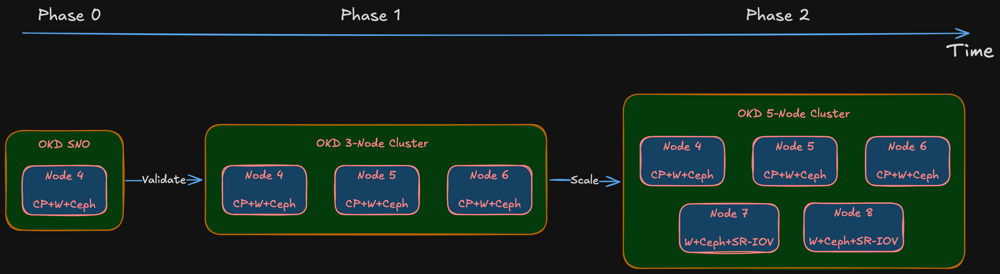
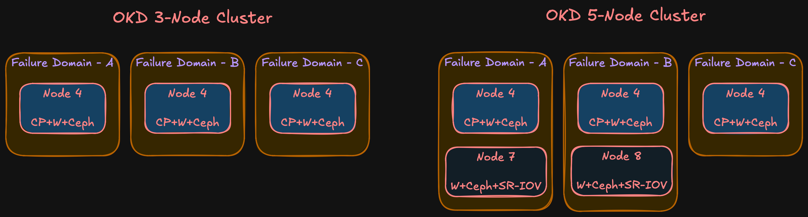

import Callout from '@/components/Callout.astro'

## How many nodes?

Minimum viable OKD cluster is three nodes. That's driven by etcd — it needs a quorum (majority of members healthy). Three members = you can lose one. Two = you can lose none. One = not distributed.

Three nodes also gives you meaningful Ceph replication. Replication factor 3 means each piece of data lives on three nodes. Lose one, data is still on the remaining two while Ceph rebalances.

The plan is phased:

<Callout title="Deployment phases" variant="summary">
  - **Phase 0: OKD Single Node (SNO).** Full OKD deployment on one machine to validate hardware, storage, and networking. If something fundamental doesn't work — NIC incompatibility, BIOS issue, storage controller conflict — better to find out on one node than three.
  - **Phase 1: Three nodes (Nodes 4, 5, 6).** Combined control plane + worker. Each node in etcd, running OKD control plane, accepting workloads. Three nodes, three failure domains.
  - **Phase 2: Five nodes (add Nodes 7, 8).** Worker-only nodes. Control plane stays on Nodes 4-6. More compute, more Ceph OSDs, SR-IOV networking for IoT/DMZ passthrough.
</Callout>

Why not go straight to five? Phase 0 validates hardware. Phase 1 validates architecture. Phase 2 scales it. Buying five machines before validating on one is exactly the impulse-purchase approach this series avoids.

<Callout title="Node numbering" variant="note">
  Starts at Node 4 because Nodes 1-3 are existing infrastructure — the OptiPlex 7050 Micro (Node 1) and reserved IDs for future lightweight roles.
</Callout>

## Sizing: CPU and memory

OKD's control plane isn't lightweight. API server, etcd, controller manager, scheduler, OAuth, image registry, monitoring stack (Prometheus, Alertmanager, Grafana), ingress controllers — all running on nodes that also handle workloads.

Red Hat's minimum for an OpenShift control plane node: 4 vCPUs, 16 GB RAM. That's the spec where the cluster boots but Prometheus gets OOMKilled as soon as you deploy something real.

For combined control plane + worker with Ceph OSDs on the same node, I need more:

**CPU: 8 cores / 16 threads.** Room for the control plane, Ceph OSD processes (one per disk, two or three per node), monitoring, and actual application pods. Desktop 8-core processors are widely available in SFF chassis on the used market — specific model is a BOM decision.

<Callout title="Memory sizing" variant="tip">
  **64 GB minimum, upgradeable to 128 GB.** Each Ceph OSD uses ~4 GB RAM. Two or three OSDs per node = 8-12 GB just for storage. OKD control plane and monitoring take another 12-16 GB. That leaves 36-44 GB for workloads and VMs — okay, but not extravagant. 32 GB would choke once VMs enter the picture.
</Callout>

The design requires four DIMM slots. Start with 2 x 32 GB (64 GB) for Phase 1. Once the cluster is stable and I can see actual memory pressure under real workloads, the other two slots can take another 2 x 32 GB to hit 128 GB. The upgrade decision gets made on data, not guesswork.

## Why small form factor?

The chassis choice is a BOM decision. But the design sets clear requirements:

<Callout title="Chassis requirements" variant="definition">
  - **Four DIMM slots** — 64 GB at launch, path to 128 GB
  - **At least one PCIe x8 (Gen 3) slot** — for a dual-port 10 Gbps SFP+ NIC. Most important expansion slot. Without it, storage networking is 1 Gbps and Ceph performance tanks
  - **One M.2 NVMe slot** — fast Ceph OSD tier
  - **One 2.5" SATA bay (or second M.2)** — boot drive, separate from Ceph
  - **One 3.5" drive bay** — slow Ceph OSD tier, large HDD. This alone rules out micro/ultra-compact form factors
  - **Desktop-class TDP** — 65W, not 150W+
</Callout>

SFF doesn't rack-mount without shelves, which adds physical planning (covered later). But the power/noise/cost trade-off is worth it for a homelab that coexists with a household.

## Failure domains

In cloud, failure domains are availability zones — entire data centers. In a homelab, every node sits in the same room, same power circuit, same shelf. Technically, all nodes could be in a single failure domain and that would be honest.

But that defeats the purpose. The main reason to set up separate failure domains in a homelab is to learn how they actually work — how Ceph distributes replicas across them, how pod anti-affinity interacts with topology constraints, how OKD handles node failures within failure domain awareness. One node per failure domain gives the most production-realistic behavior at homelab scale.

With three nodes and three failure domains:

- **etcd:** Three members, quorum survives one node loss
- **Ceph:** Replication-3, one replica per FD. Data survives one node failure, Ceph rebalances from remaining replicas
- **OKD control plane:** Three API server instances. Pod disruption budgets prevent quorum violations during rolling operations
- **Workloads:** Anti-affinity spreads replicas across FDs. One node loss = at most one-third of capacity

Phase 2 doesn't change the model — still three FDs. Nodes 7 and 8 join FD-A and FD-B respectively. Some asymmetry (FD-C has one node, others have two), but the important thing is no single FD holds a majority of etcd members or Ceph replicas.

## Node roles

| Node | Phase | Roles | Failure Domain |
|------|-------|-------|----------------|
| Node 4 | Phase 1 | Control plane + Worker + Ceph OSD | FD-A |
| Node 5 | Phase 1 | Control plane + Worker + Ceph OSD | FD-B |
| Node 6 | Phase 1 | Control plane + Worker + Ceph OSD | FD-C |
| Node 7 | Phase 2 | Worker + Ceph OSD | FD-A |
| Node 8 | Phase 2 | Worker + Ceph OSD | FD-B |

## What's not decided yet

<Callout title="Deferred to Bill of Materials" variant="note">
  - **Chassis make and model** — design defines requirements. Multiple vendors meet this. Choice depends on market availability and compatibility.
  - **HDD model and capacity** — need large HDDs for slow Ceph tier. Depends on pricing and availability.
  - **DDR4 frequency** — various speeds work. Difference between DDR4-2400 and DDR4-3200 is negligible for this workload.
  - **NIC model** — need dual-port SFP+. Intel X710, Mellanox ConnectX-3, others. Procurement and compatibility decision.

  These aren't gaps — they're the boundary between design and procurement. The design says "64 GB DDR4, 4 DIMM slots, dual-port SFP+." The BOM says which exact module, from where, at what price.
</Callout>

## Summary

<Callout title="Compute design at a glance" variant="summary">
  - **Phase 0 (SNO)** validates hardware → **Phase 1 (3 nodes)** validates architecture → **Phase 2 (5 nodes)** scales
  - Combined control plane + worker on Phase 1 nodes; Phase 2 adds workers
  - 8 cores / 16 threads per node
  - 64 GB RAM (2 x 32 GB), upgradeable to 128 GB (4 DIMM slots)
  - Three storage tiers: boot SSD, fast NVMe (Ceph), slow HDD (Ceph)
  - Dual-port 10 Gbps SFP+ for storage networking
  - 1 Gbps RJ45 for management
  - SFF form factor — power, noise, cost
  - Three failure domains in both phases
  - OKD on SCOS with Rook-Ceph
</Callout>

Every decision traces back to the requirements from the [why post](/blog/homelab-why). Hardware specifics come in the BOM post. Next up: network architecture — because none of this works without the right connectivity between nodes.
