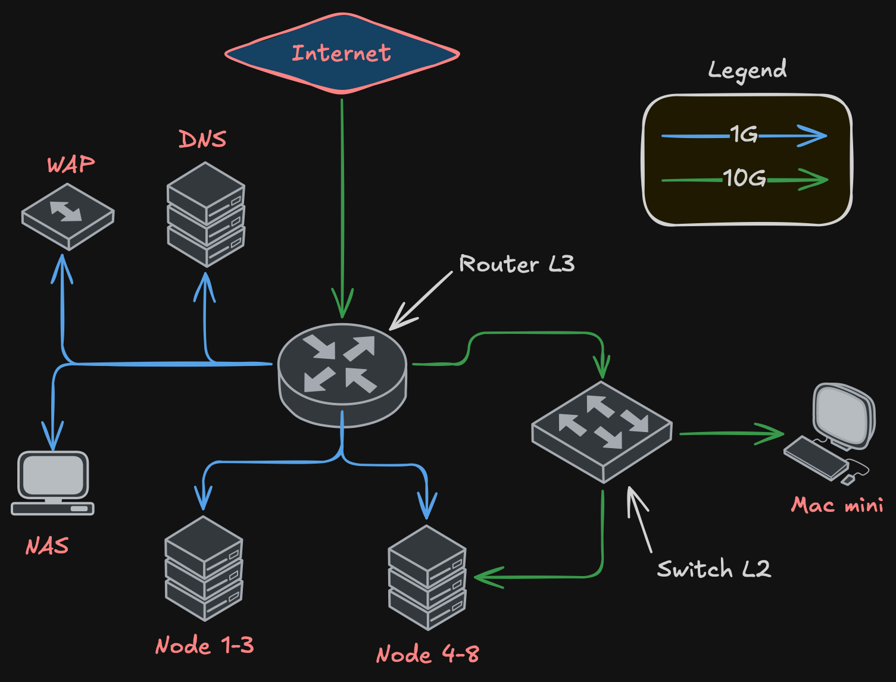
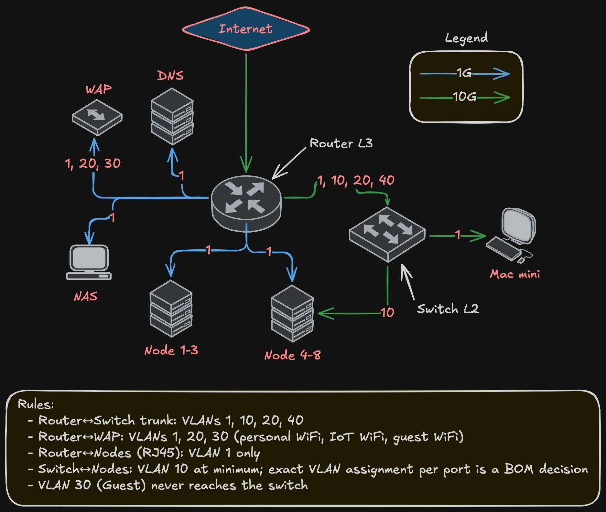

import Callout from '@/components/Callout.astro'

[Previous post](/blog/homelab-design/compute) defined the cluster: 3-5 nodes, 64-128 GB RAM, three storage tiers, 10 Gbps storage networking. None of that matters without the right network underneath.

Network comes before storage, before the platform, before any deployment. Get the network wrong and Ceph performance tanks, security boundaries don't exist, and troubleshooting becomes guesswork. This post covers the network design — VLAN segmentation, IP addressing, firewall policy, and what the hardware needs to support.

## Why dedicated storage networking

Ceph replicates every write across three nodes. Replication factor 3 means a 1 GB write generates 3 GB of network traffic. Add recovery and rebalancing after a node failure, and you get sustained multi-gigabit flows between nodes.

Running that on the same 1 Gbps link that handles SSH, API traffic, and pod-to-pod communication is asking for trouble. Storage saturates the link, everything else suffers, and you spend hours debugging latency that's actually a bandwidth problem.

<Callout title="Non-negotiable" variant="important">
  Dedicated storage networking on a separate VLAN, separate physical interfaces, at 10 Gbps minimum — that's the baseline for this design. Not a nice-to-have.
</Callout>

## VLAN design

Five VLANs, each with a clear purpose:

| VLAN | Name | Subnet | Purpose |
|------|------|--------|---------|
| 1 | Frontnet | 192.168.1.0/24 | Management, SSH, API, pod-to-pod |
| 10 | Backnet | 192.168.10.0/24 | Ceph storage traffic, fully isolated |
| 20 | IoT | 192.168.20.0/24 | IoT devices, firewalled |
| 30 | Guest | 192.168.30.0/24 | Untrusted devices, internet-only |
| 40 | DMZ | 192.168.40.0/24 | OKD ingress, external-facing services |

**Frontnet (VLAN 1)** is the management network. Every node has a 1 Gbps RJ45 interface here. SSH, Kubernetes API, internal pod traffic, DHCP — all on Frontnet.

**Backnet (VLAN 10)** is storage only. Fully isolated — no inter-VLAN routing, no gateway forwarding traffic elsewhere. Ceph OSD replication, recovery, and heartbeats happen here and nowhere else. This isolation isn't optional. Storage traffic should never leak into other networks, and nothing should interfere with storage.

**IoT (VLAN 20)** is for devices that need network access but shouldn't reach the rest of the infrastructure. Sensors, cameras, smart home devices. Firewalled from Frontnet and Backnet.

**Guest (VLAN 30)** is for untrusted devices. Internet access only, no access to internal VLANs. WiFi only — served by the wireless access point, never touches the wired switching infrastructure.

**DMZ (VLAN 40)** is for OKD ingress. External-facing services route through here. The OKD API and ingress VIPs live on this VLAN. Keeps external traffic separate from management and storage.

## Topology requirements

The network needs two devices: a router for L3 (inter-VLAN routing, firewall, DHCP, NAT) and a switch for L2 (high-speed switching for storage traffic).

<Callout title="Router requirements" variant="definition">
  - At least 2x 10 Gbps ports — one for ISP uplink, one for trunk to the switch
  - At least 10x RJ45 1 Gbps ports — management connections for all nodes, NAS, WAP, DNS server
  - VLAN-aware with bridge filtering
  - Firewall capable of inter-VLAN rules
  - DHCP server for multiple VLANs
</Callout>

<Callout title="Switch requirements" variant="definition">
  - At least 8x 10 Gbps ports — one per node (5 nodes), one trunk to router, a couple spare
  - L2 switching with hardware offload
  - VLAN tagging support
  - Jumbo frame support (MTU 9000 for storage)
</Callout>

The router handles all 1 Gbps connections directly — node management interfaces, NAS, WAP, DNS. The switch handles all 10 Gbps connections — node storage interfaces and the trunk back to the router.

The trunk between router and switch carries VLANs 1, 10, 20, and 40. Guest (VLAN 30) never touches the switch — it exists only on the WAP's WiFi and routes through the router to the internet.

## Why not spine-leaf?

At this scale — under 12 nodes — spine-leaf is overkill. You'd need at least two spine and two leaf switches for meaningful redundancy. Four switches plus cabling doesn't justify itself for 5 nodes.

This is a collapsed design: one router (L3), one switch (L2). Single point of failure at the switch? Yes. For a homelab, acceptable. If the switch dies, there's no storage networking, which means Ceph can't replicate, which means the cluster isn't healthy anyway. A second switch would add path redundancy but doesn't change the "one room, one power circuit" reality.

## VLAN flows

Not every VLAN exists on every link:

Key points:
- Router-to-switch trunk carries VLANs 1, 10, 20, 40
- WAP gets VLANs 1, 20, 30 — three SSIDs, three VLANs, one cable
- Guest (VLAN 30) is WiFi-only, never touches wired switching
- Node management (RJ45) is VLAN 1 only
- Node storage (10G) carries at least VLAN 10; whether additional VLANs are trunked to specific nodes depends on NIC capabilities — a BOM decision

## IP addressing

Static addresses for infrastructure, DHCP for clients.

**Frontnet (192.168.1.0/24):**

| IP | Device |
|----|--------|
| .1 | Gateway |
| .2 | NAS |
| .3 | Mac mini |
| .4-.6 | Nodes 1-3 |
| .7-.9 | Nodes 4-6 |
| .10-.11 | Nodes 7-8 |
| .12-.254 | DHCP pool |

**Backnet (192.168.10.0/24):**

| IP | Device |
|----|--------|
| .1 | Gateway |
| .2-.4 | Nodes 4-6 |
| .5-.6 | Nodes 7-8 |

<Callout title="No DHCP on Backnet" variant="warning">
  All static. This is a dedicated storage network — nothing should be dynamically joining it.
</Callout>

**DMZ (192.168.40.0/24):**

| IP | Device |
|----|--------|
| .1 | Gateway |
| .253 | OKD API VIP |
| .254 | OKD Ingress VIP |

IoT (192.168.20.0/24) and Guest (192.168.30.0/24) use DHCP — no static assignments needed.

## Inter-VLAN firewall policy

Not every VLAN should talk to every other VLAN:

<Callout title="Firewall rules" variant="important">
  - **Backnet → anywhere:** Denied. Storage stays on Backnet. No exceptions.
  - **Anywhere → Backnet:** Denied. Nothing outside storage reaches Ceph.
  - **Guest → Internet:** Allowed. Only thing Guest can do.
  - **Guest → any internal VLAN:** Denied.
  - **IoT → Frontnet:** Denied by default. Specific rules for devices that need internal services.
  - **IoT → Internet:** Allowed (cloud-dependent devices).
  - **DMZ → Internet:** Allowed (ingress traffic).
  - **DMZ → Frontnet:** Limited to OKD API and specific backend services.
  - **Frontnet → everything:** Allowed. Management network has full access.
</Callout>

The key principle: Backnet is a walled garden. No traffic in, no traffic out, except between Ceph OSDs and monitors on VLAN 10. No exceptions.

## What's deferred

<Callout title="Deferred to Bill of Materials" variant="note">
  - **Specific router and switch models** — the design defines port count and capability requirements.
  - **10G connector type (SFP+ with DAC, RJ45 10GbE, etc.)** — BOM decision.
  - **Port redundancy and bonding** — one 10G port per node is sufficient. Whether to add a second port for redundancy or bonding is a BOM decision.
  - **Per-node VLAN assignment on 10G ports** — depends on NIC model and node role.
  - **MTU configuration** — Ceph benefits from jumbo frames (MTU 9000) on Backnet. Exact config depends on NIC and switch firmware.
  - **Router/switch configuration** — implementation post. Bridge VLAN filtering, DHCP servers, firewall rules.
</Callout>

## Summary

<Callout title="Network design at a glance" variant="summary">
  - Five VLANs: Frontnet (management), Backnet (storage), IoT, Guest, DMZ
  - Router (L3) + switch (L2) topology — router needs 2x 10G and 10+ RJ45, switch needs 8+ 10G ports
  - Dedicated 10 Gbps storage networking on Backnet, fully isolated
  - One 10G storage interface per node minimum; redundancy is a BOM decision
  - 1 Gbps management on all nodes via router
  - Static IPs for infrastructure, DHCP for clients
  - Guest is WiFi-only, never touches wired switching
  - Backnet isolation is a hard requirement, not a preference
</Callout>

Next post covers [storage architecture](/blog/homelab-design/storage) — how Ceph uses this network to distribute data across the tiered storage design from the compute post.
