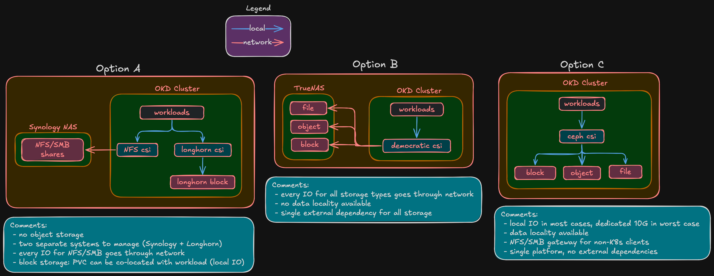
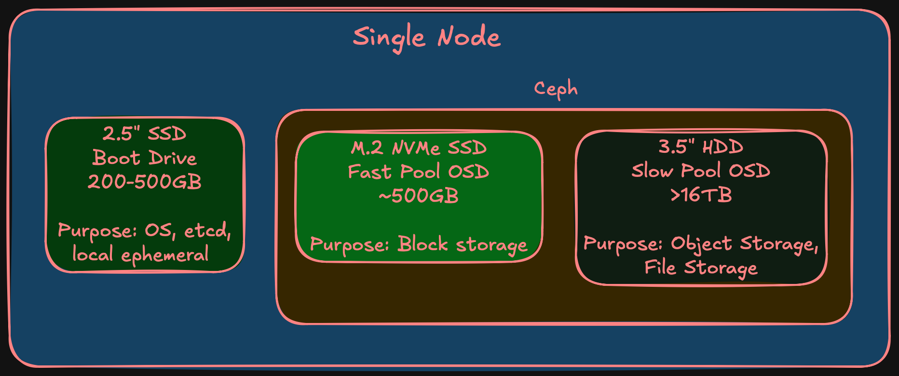
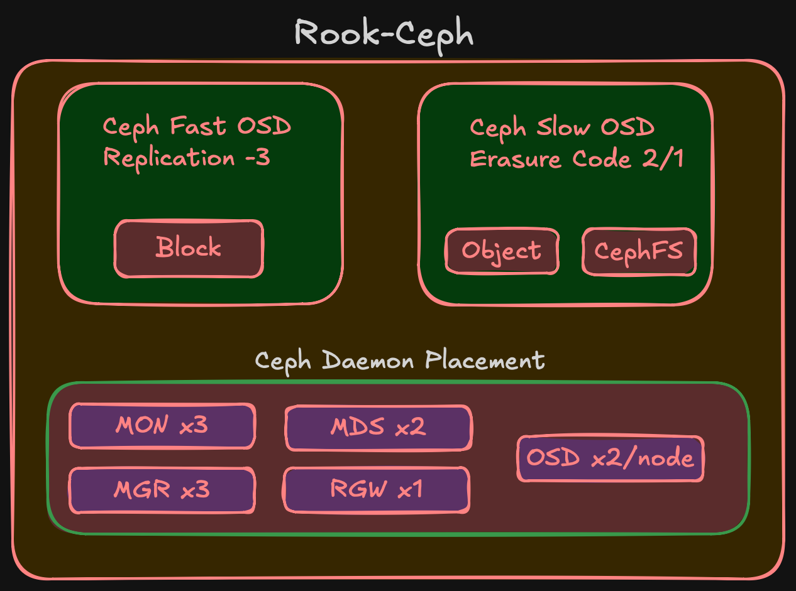

import Callout from '@/components/Callout.astro'

[Previous post](/blog/homelab-design/network) covered the network — VLANs, isolated 10G storage, firewall policy. This post covers what runs on top of it: Ceph, managed by Rook-Ceph.

## Why Ceph

There are several ways to handle storage for this cluster, and Ceph wasn't the only option.

The simplest approach: keep the Synology NAS for file shares and run Longhorn inside the cluster for block storage. Or go with a dedicated TrueNAS box — it handles block (iSCSI), file (NFS/SMB), and object (MinIO S3) from one appliance. Both are valid, plenty of homelabs work this way.

But this is a hyperconverged build. The whole point of HCI is that compute, storage, and networking run on the same nodes. With external storage — whether Synology, TrueNAS, or anything else — almost every I/O from a pod crosses the network to a separate box and back. That's a bottleneck, especially for latency-sensitive workloads like databases. With Ceph on the same nodes, the primary OSD for a PVC can live on the same node as the pod. I/O stays local or crosses one 10G hop at worst.

Ceph fits the HCI model — data distributed across the same nodes that run workloads, replicated by failure domain, self-healing. Rook-Ceph manages it as a Kubernetes operator, same lifecycle as everything else on the platform.

### Ceph vs Longhorn

Longhorn is the other common Kubernetes-native storage option. Here's where they differ:

| | Ceph (Rook) | Longhorn |
|---|---|---|
| **Block storage** | RBD (kernel driver) | iSCSI (V1) / NVMe-oF (V2 preview) |
| **Shared filesystem (RWX)** | CephFS | NFS pod per volume (workaround) |
| **Object storage (S3)** | RGW | Not supported |
| **NFS/SMB gateway** | NFS-Ganesha + Samba | Not supported |
| **Erasure coding** | Full support | Not supported |
| **RAM overhead (3 nodes)** | ~12-18 GB | ~1-2 GB |
| **CNCF status** | Graduated | Sandbox |

Longhorn is simpler and lighter. But it only does block storage — no filesystem, no object, no erasure coding. For a project that needs all three storage types plus efficient capacity usage, it's not enough.

And there's the experience angle. I work with OpenShift daily, but at the platform level — I never touch the Ceph layer underneath. Building Rook-Ceph from scratch means understanding CRUSH maps, OSD lifecycle, PG management, erasure coding profiles — the internals that managed Ceph abstracts away. That knowledge directly benefits my professional work.

## Three tiers per node

Each node has three storage devices:

| Tier | Media | Capacity | Purpose | Part of Ceph? |
|------|-------|----------|---------|---------------|
| Boot | 2.5" SSD | 200-500 GB | SCOS, etcd, local ephemeral | No |
| Fast OSD | M.2 NVMe | ~500 GB | Block storage (databases, VMs) | Yes — fast pool |
| Slow OSD | 3.5" HDD | 16+ TB | Object, filesystem, backups | Yes — slow pool |

<Callout title="Boot drive endurance" variant="warning">
  The boot drive has a specific requirement: **high write endurance**. etcd fsyncs on every Kubernetes API change — consumer SSDs with low TBW will wear out. Enterprise-grade endurance is required. Specific model is a BOM decision.
</Callout>

## Two pools, two strategies

A database needs sub-millisecond latency. A media archive needs capacity. Mixing NVMe and HDD in one pool means Ceph might place a hot replica on spinning rust — 0.1ms becomes 10ms. Two pools, pinned to device classes via CRUSH rules.

### Fast pool (NVMe) — replication-3

Three copies, one per failure domain. Simple, works cleanly with RBD. EC on NVMe isn't worth it — small pool, minimal space savings, adds CPU overhead.

| Phase | Raw | Usable (rep-3) |
|-------|-----|----------------|
| Phase 1 (3 nodes) | 1.5 TB | ~500 GB |
| Phase 2 (5 nodes) | 2.5 TB | ~833 GB |

Not a lot, but block storage for databases and VMs doesn't need terabytes.

### Slow pool (HDD) — erasure coding

This is where the interesting decision is. The slow pool has the most raw capacity and benefits most from efficient replication.

**Phase 1 (3 nodes) — two options:**

| Strategy | Usable | Overhead | Failures tolerated | Recovery headroom |
|----------|--------|----------|--------------------|--------------------|
| **EC 2/1** | ~32 TB (67%) | 1.5x | 1 | None — no 4th node to rebuild on |
| **Rep-3** | ~16 TB (33%) | 3.0x | 2 | Full — any 2 of 3 nodes can rebuild |

EC 2/1 doubles usable space but has no recovery headroom on exactly 3 nodes. If one node goes down, Ceph serves data fine but can't rebuild the missing chunk. Second failure during that window = data loss. For media and backups that exist elsewhere, probably acceptable. For anything critical, it isn't.

<Callout title="Leaning EC 2/1" variant="note">
  The slow pool stores media, backups, and archives — data that can be re-obtained. But I haven't committed yet and may change my mind during validation.
</Callout>

**Phase 2 (5 nodes): EC 3/2** — 3 data + 2 parity. 60% usable, survives 2 failures.

| Phase | Strategy | Raw | Usable |
|-------|----------|-----|--------|
| Phase 1 (3 nodes) | EC 2/1 | 48+ TB | ~32 TB |
| Phase 1 (3 nodes) | Rep-3 | 48+ TB | ~16 TB |
| Phase 2 (5 nodes) | EC 3/2 | 80+ TB | ~48 TB |

<Callout title="EC migration" variant="warning">
  EC profiles are immutable — can't change after pool creation. EC 2/1 → EC 3/2 requires creating a new pool and migrating data. CephFS supports multi-pool layouts for this; RBD has live migration. Not trivial, but documented.
</Callout>

## Ceph daemons

| Daemon | Count | Purpose | HA |
|--------|-------|---------|-----|
| MON | 3 | Cluster map, quorum | Survives 1 node loss |
| MGR | 2 | Metrics, dashboard | Active + standby |
| MDS | 2 | CephFS namespace | Active + standby |
| RGW | 1 | S3 endpoint | Scales later if needed |
| OSD | 2 per node | One NVMe + one HDD per node | Phase 1: 6, Phase 2: 10 |

## StorageClasses

What workloads see:

| StorageClass | Ceph pool | Access mode | Use case |
|---|---|---|---|
| `ceph-block-fast` | NVMe (rep-3) | RWO | Databases, VM disks |
| `ceph-filesystem` | HDD (EC) | RWX | Shared filesystems |
| `ceph-object` | HDD (EC) | S3 API | Backups, media, archives |

Workloads reference the StorageClass in their PVC. CRUSH rules, device classes, EC profiles — that's infrastructure, not their problem.

## What's deferred

<Callout title="Deferred decisions" variant="note">
  - **Drive models and capacities** — BOM post
  - **Boot drive endurance spec** — BOM, real cost implications
  - **Final EC 2/1 vs rep-3 decision** — can wait until deployment
  - **Rook-Ceph CRDs** — implementation post
  - **EC migration procedure** — Phase 2 implementation
  - **Ceph tuning** — OSD memory, PG counts, scrub schedules. Day-2
</Callout>

## Summary

<Callout title="Storage design at a glance" variant="summary">
  - Ceph via Rook-Ceph — fits the HCI model, covers block + filesystem + object from one cluster
  - Alternatives considered (Synology + Longhorn, TrueNAS) but don't fit hyperconverged approach
  - Hands-on Ceph experience directly benefits professional work
  - Three tiers per node: boot SSD (local), fast NVMe (Ceph), slow HDD (Ceph)
  - Fast pool: NVMe, rep-3, ~500 GB usable in Phase 1
  - Slow pool: HDD, leaning EC 2/1 in Phase 1 (~32 TB), EC 3/2 in Phase 2 (~48 TB)
  - NFS/SMB gateway available if I want to replace the Synology later
  - Rook-Ceph as operator — CNCF Graduated, Kubernetes-native lifecycle
</Callout>

This is the last design subpost. Compute, network, and storage together define what the cluster needs. Next comes the BOM — where requirements become hardware with real prices.
