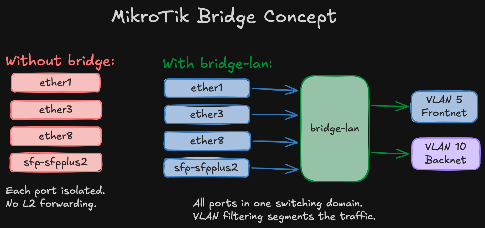

import Callout from '@/components/Callout.astro'

The [network design post](/blog/homelab-design/network) defined VLANs, firewall policy, and device requirements. This is where that design hits real hardware — CCR2004 router and CRS317 switch, factory reset to a working VLAN-segmented network. One node, two VLANs, two devices. Everything else waits.

<Callout title="What's in scope" variant="summary">
  - **VLAN 5 (Frontnet)** — management, SSH, DHCP, DNS. OKD API and ingress VIPs also live here for SNO.
  - **VLAN 10 (Backnet)** — storage network. Fully isolated, no internet, no inter-VLAN routing.
  - **Factory reset on both devices** — clean slate.
</Callout>

<Callout title="What's deferred" variant="note">
  VLAN 20 (IoT), VLAN 30 (Guest), VLAN 40 (DMZ), LACP bonds, jumbo frames, SR-IOV. All added when the endpoints that need them exist.
</Callout>

## Wait — the design said VLAN 1

Yes. The network design post used VLAN 1 as the Frontnet/management VLAN. That's the natural choice — VLAN 1 is the default PVID on every port, and every MikroTik guide uses it.

It didn't work.

With VLAN filtering enabled on both the CCR2004 and CRS317, every device behind the CRS317 — the Mac mini, anything on the storage network — lost connectivity. DHCP stopped, ARP stopped, pings timed out. Devices directly connected to the router's RJ45 ports worked fine. The problem was specific to the 10G trunk between the two devices.

After hours of troubleshooting — packet captures on every interface, toggling HW offload, swapping SFP+ ports, factory resets on both — the root cause: the Marvell Prestera switch chip in the CRS317 doesn't reliably handle VLAN 1 when carried **tagged** on a trunk. ARP broadcasts flood correctly, but unicast ARP replies and DHCP offers get silently dropped before reaching the destination access port.

VLAN 1 has special semantics in 802.1Q — it's the "default" VLAN, and some hardware treats it differently in the forwarding pipeline. The Marvell 98DX8216 in the CRS317 is one of those cases.

<Callout title="Lesson learned" variant="danger">
  Avoid VLAN 1 on MikroTik trunk links, especially between devices with different switch chips (CCR2004 uses Marvell 88E6191X, CRS317 uses Marvell 98DX8216). Use any other VLAN ID. This costs nothing and eliminates an entire class of hard-to-debug forwarding issues.
</Callout>

The fix: don't use VLAN 1. I picked VLAN 5. Set it as PVID on all access ports, carry it tagged on the trunk. Everything works immediately.

## Physical cabling

Before any configuration:

| From | Port | To | Port | Cable |
|------|------|----|------|-------|
| ISP bridge | — | CCR2004 | sfp-sfpplus1 | RJ45 SFP+ module |
| CCR2004 | sfp-sfpplus2 | CRS317 | sfp-sfpplus1 | DAC 0.3m |
| CCR2004 | ether1 | Synology NAS | LAN 1 | RJ45 |
| CCR2004 | ether3 | WAP | ether1 | RJ45 |
| CCR2004 | ether4 | DNS server | eth0 | RJ45 |
| CCR2004 | ether8 | Node 4 | onboard NIC | RJ45 |
| CCR2004 | ether13 | CRS317 | ether1 | RJ45 (OOB mgmt) |
| CRS317 | sfp-sfpplus2 | Node 4 | CX4121C port 1 | DAC |
| CRS317 | sfp-sfpplus12 | Mac mini | 10G NIC | RJ45 SFP+ module |

Node 4's second CX4121C port (sfp-sfpplus3) is reserved for LACP bonding later. Ports for Nodes 5-8 are reserved but disabled.

## Factory reset — both devices

Both devices must start clean. The MikroTik default config creates a bridge with all ports — those remnants will conflict with VLAN filtering.

```routeros
# CCR2004:
/system reset-configuration no-defaults=yes skip-backup=yes

# CRS317:
/system reset-configuration no-defaults=yes skip-backup=yes
```

After reset, the device has no IP, no bridge, nothing. Reconnect via MAC Winbox.

## CCR2004 router configuration

The CCR2004 is the edge router — NAT boundary, DHCP server, inter-VLAN firewall, gateway for everything.

### System basics

```routeros
/system identity set name="gw-home"
/system clock set time-zone-name=Europe/Warsaw

/ip service
set telnet disabled=yes
set ftp disabled=yes
set api disabled=yes
set api-ssl disabled=yes
set winbox address=192.168.1.0/24

/system ntp client set enabled=yes
/system ntp client servers add address=pool.ntp.org
```

### What is bridge-lan and why does everything go into it?

In MikroTik, a bridge is a virtual switch — it connects physical ports at L2. Without one, each port on the CCR2004 is isolated. Devices on ether1 can't talk to devices on ether8. Adding ports to `bridge-lan` creates a single switching domain — like plugging everything into the same unmanaged switch. VLAN filtering on top of that bridge creates the segmentation: ports tagged for VLAN 5 can only talk to other VLAN 5 ports, VLAN 10 only to VLAN 10, etc.



The WAN interface (sfp-sfpplus1) deliberately stays **out** of the bridge. It's a routed interface — traffic between LAN and WAN goes through the router's IP stack (NAT, firewall), not through L2 switching.

### Bridge and ports

```routeros
/interface bridge add name=bridge-lan \
    vlan-filtering=no \
    pvid=5 \
    comment="LAN bridge — enable vlan-filtering LAST"
```

<Callout title="vlan-filtering=no is deliberate" variant="warning">
  The bridge is created with filtering off and enabled as the very last step, after everything else is verified. Enabling it with incorrect VLAN table entries will silently drop frames and lock you out. Every MikroTik VLAN guide warns about this. Every homelab builder learns it the hard way.
</Callout>

```routeros
# Synology NAS (ether2 reserved for future LACP bond)
/interface bridge port add bridge=bridge-lan interface=ether1  pvid=5 comment="Synology"
/interface bridge port add bridge=bridge-lan interface=ether3  pvid=5 comment="WAP"
/interface bridge port add bridge=bridge-lan interface=ether4  pvid=5 comment="DNS-server"
# Nodes 1–3 (legacy / future)
/interface bridge port add bridge=bridge-lan interface=ether5  pvid=5 comment="Node-1"
/interface bridge port add bridge=bridge-lan interface=ether6  pvid=5 comment="Node-2"
/interface bridge port add bridge=bridge-lan interface=ether7  pvid=5 comment="Node-3"
# Node 4 (active for SNO)
/interface bridge port add bridge=bridge-lan interface=ether8  pvid=5 comment="Node-4"
# Nodes 5–8 (ports in bridge, nothing plugged in yet)
/interface bridge port add bridge=bridge-lan interface=ether9  pvid=5 comment="Node-5"
/interface bridge port add bridge=bridge-lan interface=ether10 pvid=5 comment="Node-6"
/interface bridge port add bridge=bridge-lan interface=ether11 pvid=5 comment="Node-7"
/interface bridge port add bridge=bridge-lan interface=ether12 pvid=5 comment="Node-8"
# CRS317 OOB management
/interface bridge port add bridge=bridge-lan interface=ether13 pvid=5 comment="CRS317-OOB"
# 10G trunk to CRS317
/interface bridge port add bridge=bridge-lan interface=sfp-sfpplus2 pvid=5 comment="Trunk-to-CRS317"
```

Every LAN port gets PVID=5. The WAN interface (sfp-sfpplus1) stays out of the bridge — it's routed.

### VLAN table

```routeros
# VLAN 5 — Frontnet: tagged on bridge + trunk, untagged on access ports
/interface bridge vlan add bridge=bridge-lan vlan-ids=5 \
    tagged=bridge-lan,sfp-sfpplus2 \
    untagged=ether1,ether3,ether4,ether5,ether6,ether7,ether8,ether9,ether10,ether11,ether12,ether13

# VLAN 10 — Backnet: tagged on bridge + trunk only (storage ports are on CRS317)
/interface bridge vlan add bridge=bridge-lan vlan-ids=10 \
    tagged=bridge-lan,sfp-sfpplus2
```

Two VLANs, two entries. IoT/Guest/DMZ added when needed.

### VLAN interfaces and IP addressing

```routeros
/interface vlan add name=vlan5-frontnet interface=bridge-lan vlan-id=5
/interface vlan add name=vlan10-backnet  interface=bridge-lan vlan-id=10

/ip address add address=192.168.1.1/24  interface=vlan5-frontnet  comment="Frontnet gateway"
/ip address add address=192.168.10.1/24 interface=vlan10-backnet  comment="Backnet gateway"
```

<Callout title="No IP on bridge-lan" variant="important">
  The gateway IP lives on `vlan5-frontnet`, not on the bridge directly. This is required when using VLAN 5 instead of default VLAN 1 — the DHCP server and firewall rules reference `vlan5-frontnet` as the Frontnet interface.
</Callout>

The Backnet gateway exists for diagnostics only — you can ping storage IPs from the router. Storage nodes should never use `192.168.10.1` as default route.

### DNS

DNS static records and OKD-specific entries (API VIP, wildcard ingress) are covered in the SNO validation post — they're part of the OKD prerequisites, not the base network config.

### DHCP

```routeros
/ip dhcp-client add interface=sfp-sfpplus1 use-peer-dns=no use-peer-ntp=no \
    add-default-route=yes comment="WAN DHCP"

/ip pool add name=pool-frontnet ranges=192.168.1.50-192.168.1.249

/ip dhcp-server add name=dhcp-frontnet interface=vlan5-frontnet \
    address-pool=pool-frontnet lease-time=12h disabled=no

/ip dhcp-server network add address=192.168.1.0/24 gateway=192.168.1.1 \
    dns-server=192.168.1.12 domain=home.lab ntp-server=192.168.1.1
```

<Callout title="DHCP binds to vlan5-frontnet, not bridge-lan" variant="warning">
  DHCP discovers arrive tagged as VLAN 5, so the server must listen on the VLAN 5 interface. Binding to `bridge-lan` means the server never sees the requests.
</Callout>

Pool: `.50–.249`. Static infrastructure: `.2–.49`. OKD VIPs: `.253–.254`. No DHCP on Backnet — storage is static only.

### Firewall

```routeros
/ip firewall filter
# INPUT
add chain=input action=accept connection-state=established,related
add chain=input action=drop connection-state=invalid
add chain=input action=accept protocol=icmp
add chain=input action=accept in-interface-list=MGMT
add chain=input action=drop in-interface-list=WAN
add chain=input action=drop

# FORWARD
add chain=forward action=accept connection-state=established,related
add chain=forward action=drop connection-state=invalid
add chain=forward action=accept in-interface=vlan5-frontnet out-interface-list=WAN \
    comment="Frontnet → Internet"
add chain=forward action=accept in-interface=vlan5-frontnet comment="Frontnet → any VLAN"
add chain=forward action=drop in-interface=vlan10-backnet comment="Backnet: drop all"
add chain=forward action=drop comment="Default drop"
```

<Callout title="Firewall references vlan5-frontnet, not bridge-lan" variant="important">
  Using `bridge-lan` would match traffic from all VLANs including Backnet, bypassing isolation entirely.
</Callout>

### NAT — why masquerade?

Standard masquerade — rewrites source addresses from RFC1918 to the router's public IP on the way out. Without it, nothing reaches the internet.

```routeros
/ip firewall nat add chain=srcnat out-interface-list=WAN action=masquerade
```

Port forwards for OKD (API on 6443, ingress on 443/80) are added when external access is needed — commented out for now.

### Bogon protection

With ISP in bridge mode, the WAN has a public IP. Private source addresses showing up on that link are spoofed — drop them before they hit the firewall:

```routeros
/ip firewall raw
add chain=prerouting action=drop in-interface-list=WAN src-address=192.168.0.0/16
add chain=prerouting action=drop in-interface-list=WAN src-address=10.0.0.0/8
add chain=prerouting action=drop in-interface-list=WAN src-address=172.16.0.0/12
```

<Callout title="If your ISP router does NAT" variant="warning">
  If your ISP router does NAT (not bridge mode) and gives the CCR2004 a `192.168.0.x` address, remove the `192.168.0.0/16` rule — it would block all return traffic.
</Callout>

### Hardening — reducing the attack surface

MikroTik ships with several services enabled by default that you don't need and shouldn't expose:

```routeros
/ip neighbor discovery-settings set discover-interface-list=LAN
/tool bandwidth-server set enabled=no
/tool mac-server set allowed-interface-list=MGMT
/tool mac-server mac-winbox set allowed-interface-list=MGMT
/ip ssh set strong-crypto=yes
```

- **Neighbor discovery** restricted to LAN — don't announce the router on the WAN interface
- **Bandwidth server** off — it's a built-in throughput testing tool, no reason to leave it running
- **MAC Winbox** restricted to MGMT (Frontnet only) — MAC-level management access from the WAN side would be a security hole
- **Strong crypto for SSH** — disables weak ciphers

### Enable VLAN filtering — last step

```routeros
/interface bridge set bridge-lan vlan-filtering=yes
```

<Callout title="With VLAN 5, filtering must be on" variant="danger">
  Unlike VLAN 1 setups where things partially work with filtering off, the Frontnet gateway IP lives on `vlan5-frontnet` — which only receives traffic when the bridge is actively tagging. Filtering off = dead network.
</Callout>

Verify immediately: `ping 192.168.1.1` from any device.

## CRS317 switch configuration

The CRS317 is pure L2. No routing, no firewall — just forwarding frames between the trunk and access ports at line rate.

### System basics + OOB management

```routeros
/system identity set name="sw-storage"
/system clock set time-zone-name=Europe/Warsaw

# OOB management on ether1 — NOT in the bridge
/ip address add address=192.168.1.200/24 interface=ether1 comment="OOB management"
/ip route add dst-address=0.0.0.0/0 gateway=192.168.1.1
/ip dns set servers=192.168.1.12
```

<Callout title="OOB management is your safety net" variant="tip">
  ether1 stays outside the bridge. If VLAN filtering breaks the bridge, you can still reach the switch at `192.168.1.200` through the router's ether13. This saved the troubleshooting session that led to the VLAN 5 fix.
</Callout>

### Disable unused ports

```routeros
/interface set sfp-sfpplus3  disabled=yes comment="Reserved (Node 4 bond port 2)"
/interface set sfp-sfpplus4  disabled=yes comment="Reserved (Node 5 storage)"
/interface set sfp-sfpplus5  disabled=yes comment="Reserved (Node 5 bond port 2)"
/interface set sfp-sfpplus6  disabled=yes comment="Reserved (Node 6 storage)"
/interface set sfp-sfpplus7  disabled=yes comment="Reserved (Node 6 bond port 2)"
/interface set sfp-sfpplus8  disabled=yes comment="Reserved (Node 7 storage)"
/interface set sfp-sfpplus9  disabled=yes comment="Reserved (Node 7 SR-IOV)"
/interface set sfp-sfpplus10 disabled=yes comment="Reserved (Node 8 storage)"
/interface set sfp-sfpplus11 disabled=yes comment="Reserved (Node 8 SR-IOV)"
/interface set sfp-sfpplus13 disabled=yes comment="Unused"
/interface set sfp-sfpplus14 disabled=yes comment="Unused"
/interface set sfp-sfpplus15 disabled=yes comment="Unused"
/interface set sfp-sfpplus16 disabled=yes comment="Unused"
```

Every unused port disabled and commented with its future purpose.

### Bridge, ports, and VLANs

```routeros
/interface bridge add name=bridge-fabric vlan-filtering=no pvid=5 \
    comment="Storage fabric bridge — enable vlan-filtering LAST"

# Trunk to router
/interface bridge port add bridge=bridge-fabric interface=sfp-sfpplus1  pvid=5  hw=yes
# Node 4 storage — PVID 10, switch assigns VLAN tag
/interface bridge port add bridge=bridge-fabric interface=sfp-sfpplus2  pvid=10 hw=yes
# Mac mini
/interface bridge port add bridge=bridge-fabric interface=sfp-sfpplus12 pvid=5  hw=yes

# VLAN 5 — Frontnet: tagged on trunk, untagged on Mac mini
/interface bridge vlan add bridge=bridge-fabric vlan-ids=5 \
    tagged=bridge-fabric,sfp-sfpplus1 untagged=sfp-sfpplus12

# VLAN 10 — Backnet: tagged on trunk, untagged on Node 4 storage
/interface bridge vlan add bridge=bridge-fabric vlan-ids=10 \
    tagged=bridge-fabric,sfp-sfpplus1 untagged=sfp-sfpplus2
```

Node 4's storage port has `pvid=10` — the node sends plain Ethernet frames, the switch handles VLAN tagging. Access-mode switching at its simplest.

`hw=yes` enables hardware offloading on the Marvell Prestera ASIC — line-rate forwarding, no CPU.

### Enable VLAN filtering

```routeros
/interface bridge set bridge-fabric vlan-filtering=yes
```

Recovery if needed: ether1 OOB at `192.168.1.200`.

## End-to-end verification

### Mac mini (through the switch)

Mac mini → CRS317 sfp-sfpplus12 (VLAN 5 untagged) → trunk → CCR2004 → internet.

```bash
ping 192.168.1.1   # Router reachable
ping 8.8.8.8       # Internet working
```

If the Mac mini gets `169.254.x.x`, force DHCP renewal: `sudo ipconfig set en0 DHCP`

### Storage network

With a single node, assign a temporary IP on the storage interface:

```bash
# Prevent NetworkManager from grabbing DHCP on the storage port
sudo nmcli device set enp1s0f0np0 managed no
sudo ip addr flush dev enp1s0f0np0
sudo ip addr add 192.168.10.2/24 dev enp1s0f0np0
sudo ip link set enp1s0f0np0 up
```

<Callout title="Disable NetworkManager on the storage interface first" variant="warning">
  The CRS317 trunk carries VLAN 5 alongside VLAN 10. NetworkManager will grab a DHCP lease from Frontnet on the storage interface, overwriting your static IP and putting storage traffic on the wrong subnet.
</Callout>

From the router:

```routeros
/ping 192.168.10.2 count=3
# Expected: Node 4 storage IP reachable
```

### VLAN isolation test

Confirm the firewall actually drops Backnet forward traffic:

```bash
# On Node 4 — force traffic via Backnet gateway:
sudo ip route add 8.8.8.8/32 via 192.168.10.1 dev enp1s0f0np0
ping -c 3 -I enp1s0f0np0 8.8.8.8
# Expected: 100% packet loss
```

```routeros
# On CCR2004 — verify firewall counter increments:
/ip firewall filter print stats where comment~"Backnet"
# Expected: packet counter > 0
```

<Callout title="Why the temporary route?" variant="note">
  Without a default gateway on the storage interface, Linux rejects the packet locally — it never hits the wire. The explicit route forces the packet through the CRS317 trunk and into the router's forward chain, where the Backnet drop rule catches it.
</Callout>

Clean up: `sudo ip route del 8.8.8.8/32 via 192.168.10.1`

## What comes next

This is the minimal foundation. Every upgrade is additive from a known-good baseline:

| Upgrade | When |
|---------|------|
| Nodes 5-6 storage ports | After SNO validation |
| Synology LACP bond | After DSM is configured for 802.3ad |
| Storage LACP bonds | After baseline throughput validation |
| Jumbo frames (MTU 9000) | After bonds are stable |
| VLAN 40 (DMZ) | When SR-IOV nodes provide ingress interfaces |
| WAP trunking (IoT/Guest) | After WAP supports VLAN trunking |
| Technitium DNS | DNS migration post |

## References

- [MikroTik docs: Bridging and Switching — VLAN Example: Trunk and Access Ports](https://help.mikrotik.com/docs/spaces/ROS/pages/328068/Bridging+and+Switching#BridgingandSwitching-VLANExample-TrunkandAccessPorts)
- [What are VLANs and how to configure them (pt.1)](https://youtube.com/watch?v=US2EU6cgHQU)
- [VLANs, pt.2: vlan-filtering and management VLAN](https://youtube.com/watch?v=YMwOrc0LDP8)
- [VLANs, pt.3: QinQ and the L2MTU mystery](https://youtube.com/watch?v=7a_z1jAdIME)
