import Callout from '@/components/Callout.astro'

I don't install a platform on hardware I haven't tested. The homelab community is full of "I just installed Proxmox and it worked" posts that skip the part where you check whether the NIC actually negotiates at the right PCIe width, the boot SSD isn't already worn out, and the storage tiers can handle concurrent I/O without bus conflicts.

CentOS Stream 10 live boot on the Dell OptiPlex 5090 SFF. The goal: a repeatable, node-agnostic checklist that proves every component before OKD touches the disk.

## Why CentOS Stream 10?

OKD 4.20 runs on SCOS 10 — CentOS Stream CoreOS, built on CentOS Stream 10 with kernel 6.12.x. Using the same base OS for validation means identical driver availability. If `mlx5_core` loads here, it loads under OKD. If your NVMe shows up here, it shows up under SCOS.

The live ISO comes from the SIGs/altimages path — not the main BaseOS (which only has installer ISOs, not live environments):

```
https://mirror.stream.centos.org/SIGs/10-stream/altimages/images/live/x86_64/
```

Use the MIN-Live image. It boots to a shell with `dnf` available — no GUI overhead, just what you need.

## Boot and install tools

CentOS Stream 10 boots, auto-logs in as `liveuser`, and you're at a shell. Kernel 6.12.0-136.el10.x86_64 — the same 6.12 series that SCOS 10 ships.

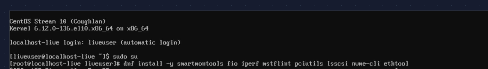

```bash
sudo su
dnf install -y smartmontools fio iperf mstflint pciutils lsscsi nvme-cli ethtool
```

Everything installs in under a minute. The live environment runs entirely from RAM — nothing touches the disks until you tell it to.

## Drive detection — all three tiers simultaneously

The OptiPlex 5090 SFF has one M.2 slot, two SATA ports, and a 3.5" drive bay. All three storage tiers must be visible at the same time.

```
# lsblk -d -o NAME,SIZE,MODEL,ROTA,TRAN,TYPE
NAME      SIZE  MODEL                ROTA  TRAN  TYPE
sda       3.6T  WDC WD40EZRZ-00GXC  1     sata  disk
sdb     372.6G  INTEL SSDSC2BX400G  0     sata  disk
nvme0n1 476.9G  PNY CS1030 500GB S  0     nvme  disk
```

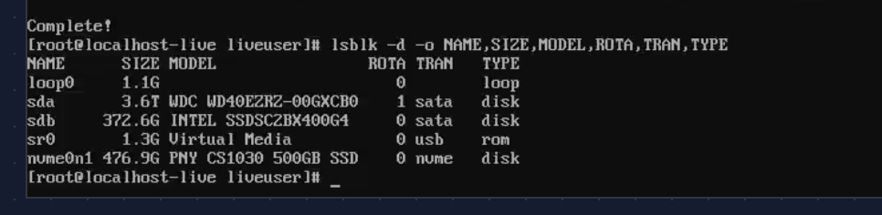

Three devices, three tiers: the Intel D3-S3610 400 GB SATA SSD (boot/etcd), the PNY CS1030 500 GB NVMe (Ceph fast pool OSD — consumer-grade, Phase 0 testing only), and the WDC 4 TB HDD (standing in for the production Toshiba 20 TB to validate the 3.5" bay clearance).

`nvme list` and `lsscsi` confirm the details:

```
# nvme list
Node          Model                SN                   Namespace  FW
/dev/nvme0n1  PNY CS1030 500GB SSD PNB46257035080101591 0x1        GT67d92d

# lsscsi
[0:0:0:0]  cd/dvd  JetKVM   Virtual Media         /dev/sr0
[1:0:0:0]  disk    ATA  WDC WD40EZRZ-00G  0A80   /dev/sda
[4:0:0:0]  disk    ATA  INTEL SSDSC2BX40   0140   /dev/sdb
```

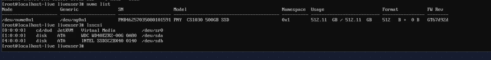

<Callout title="The PNY CS1030 is a placeholder" variant="note">
  This is a DRAM-less consumer NVMe — fine for Phase 0 validation but unsuitable for production Ceph OSD workloads. The production drives will be enterprise-grade NVMe chosen after the BOM research is complete. The point here is proving the M.2 slot works and the drive coexists with the SATA devices.
</Callout>

## SMART health

These are used/refurbished parts. SMART data tells you what you're actually working with.

**Intel D3-S3610 (boot SSD):**

```
# smartctl -a /dev/sdb | grep -E "SMART overall|Reallocated|Wear_Leveling|Media_Wear|Power_On_Hours"
SMART overall-health self-assessment test result: PASSED
  5 Reallocated_Sector_Ct    0x0032  100  100  000  Old_age  Always  -  0
  9 Power_On_Hours           0x0032  100  100  000  Old_age  Always  -  34600
226 Workld_Media_Wear_Indic  0x0032  100  100  000  Old_age  Always  -  337
233 Media_Wearout_Indicator  0x0032  100  100  000  Old_age  Always  -  0
```

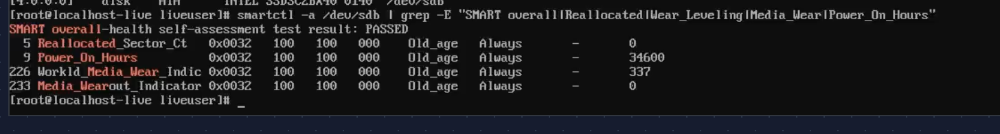

PASSED. Zero reallocated sectors. 34,600 power-on hours — about 4 years of continuous operation, typical for a decommissioned enterprise drive. Media_Wearout_Indicator at 0 with normalized 100/100 means minimal MLC wear. Plenty of life left for etcd.

**PNY CS1030 (NVMe, test only):**

```
# smartctl -a /dev/nvme0n1 | grep -E "Critical Warning|Percentage Used|Power On Hours|Media and Data Integrity"
Critical Warning:                   0x00
Percentage Used:                    0%
Power On Hours:                     3
Media and Data Integrity Errors:    0
```

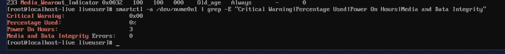

Brand new. 3 power-on hours, 0% wear. This came with the Dell from the seller.

**WDC WD40EZRZ (HDD, test drive):**

```
# smartctl -a /dev/sda | grep -E "SMART overall|Reallocated|Current_Pending|Power_On_Hours"
SMART overall-health self-assessment test result: PASSED
  5 Reallocated_Sector_Ct  0x0033  200  200  140  Pre-fail  Always  -  0
  9 Power_On_Hours         0x0032  034  034  000  Old_age   Always  -  48809
196 Reallocated_Event_Count 0x0032  200  200  000  Old_age  Always  -  0
197 Current_Pending_Sector  0x0032  200  200  000  Old_age  Always  -  0
```

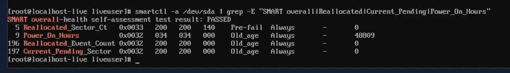

PASSED. 48,809 hours (~5.5 years), zero reallocated sectors, zero pending sectors. This is a placeholder drive — the production 20 TB Toshiba goes through the same check when it arrives. The point here is validating the 3.5" bay clearance and SATA channel.

## Concurrent I/O — the real test

Individual drive tests don't catch bus conflicts. The real question: can all three drives sustain simultaneous reads through the PCH without errors?

```bash
fio --name=ssdread --filename=$BOOT_SSD --rw=read --bs=1M --size=1G \
    --direct=1 --ioengine=libaio --iodepth=16 --runtime=30 --time_based --group_reporting \
    --name=nvme_read --filename=$NVME --rw=read --bs=1M --size=1G \
    --direct=1 --ioengine=libaio --iodepth=16 --runtime=30 --time_based --group_reporting \
    --name=hdd_read --filename=$HDD --rw=read --bs=1M --size=1G \
    --direct=1 --ioengine=libaio --iodepth=16 --runtime=30 --time_based --group_reporting
```

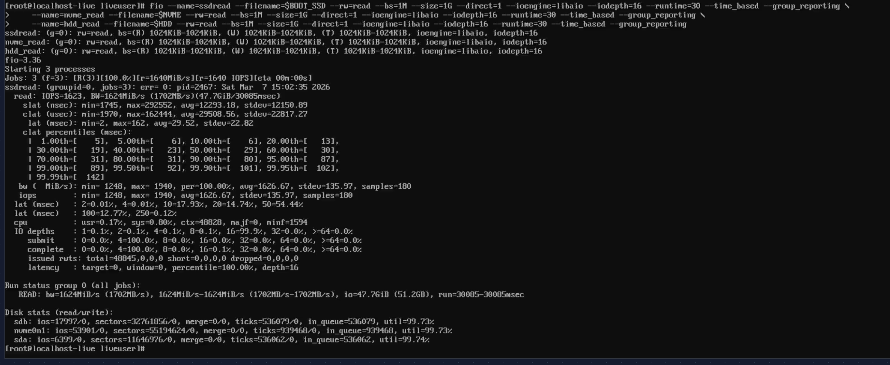

All three drives active simultaneously, all at 99.7% utilization, zero errors. The aggregate throughput: 1,702 MB/s read bandwidth. The disk stats confirm each device was hammered:

```
Disk stats (read/write):
  sdb:     ios=17997/0  (Intel SSD — saturated)
  nvme0n1: ios=53901/0  (PNY NVMe — saturated)
  sda:     ios=6399/0   (WDC HDD — saturated)
```

No bus conflicts, no I/O errors in `dmesg`. The Q570 chipset handles all three tiers without issues.

## The NIC journey: three cards, three problems

### Intel X710-DA2 — POST hang

The Intel X710-DA2 was the first choice — dual SFP+ 10GbE, `i40e` driver, [Red Hat Ecosystem Catalog certified](https://catalog.redhat.com/en/hardware/detail/236147). For a platform running SCOS (same kernel as RHEL), a Red Hat certified NIC seemed like the safe bet.

It wasn't.

I installed the X710 in the PCIe x16 slot, connected a DAC cable to the CRS317, powered on. The system hung at POST — frozen on the Dell splash screen. No BIOS, no boot menu, nothing. JetKVM showed a static Dell logo forever.

**Attempt 1: Disable Option ROM.** The X710 has a PXE/UEFI Option ROM that runs during POST. Pulled the NIC, booted into BIOS, disabled Option ROM for the PCIe slot, shut down, reinstalled. Same hang.

**Attempt 2: Every BIOS combination.** Disabled PXE boot, toggled UEFI network stack, changed PCIe slot config. Nothing. With the X710 installed, the system wouldn't POST. Without it, fine.

**Attempt 3: Reseat.** Only one usable PCIe slot in the 5090 SFF. Reseated the card, confirmed full engagement. Same result.

Scattered forum reports of Intel X710 + Dell OptiPlex compatibility issues — PCIe lane negotiation conflicts with the Dell BIOS/firmware. No official Dell or Intel docs acknowledge it. Returned the X710.

### Mellanox ConnectX-3 CX312A — driver dropped from SCOS 10

Second attempt: Mellanox ConnectX-3 CX312A. Dual SFP+ 10GbE, `mlx4_core` driver. Cheaper, widely available used.

I first tested it on an RHCOS live image (from an earlier OpenShift evaluation). PCIe detected fine, both ports visible, link up. Looked good.

Then I switched the project from OCP to OKD. OKD 4.20 runs SCOS 10, not RHCOS. Booted CentOS Stream 10 live (same kernel as SCOS 10) — `lspci` showed the card, PCIe negotiation fine. But `ip link` showed no Mellanox interfaces. No `mlx4_core` module loaded.

<Callout title="Driver removed upstream" variant="danger">
  `mlx4_core` is not included in SCOS 10 / CentOS Stream 10 kernel (6.12). The ConnectX-3 uses the mlx4 driver family, which has been deprecated upstream. RHCOS (RHEL 9 based) still carried it. SCOS 10 (RHEL 10 lineage) does not. The hardware works — the driver simply isn't there anymore.
</Callout>

Returned the ConnectX-3.

### Mellanox ConnectX-4 Lx CX4121C — finally

Third attempt: Mellanox ConnectX-4 Lx CX4121C (Dell P/N 20NJD). Dual SFP28 25GbE, `mlx5_core` driver. Dell OEM card — no chassis compatibility risk. `mlx5_core` is the current Mellanox driver, actively maintained, ships in every modern kernel.

I installed it. System booted normally. Both ports detected. Everything worked.

| | Intel X710-DA2 | Mellanox CX312A | Mellanox CX4121C (Dell 20NJD) |
|---|---|---|---|
| Dell 5090 SFF POST | **No** — hang | Yes | **Yes** |
| SCOS 10 / kernel 6.12 | N/A | **No** — mlx4_core removed | **Yes** — mlx5_core |
| Ports | 2x SFP+ 10GbE | 2x SFP+ 10GbE | 2x SFP28 25GbE |
| Driver | i40e | mlx4_core (deprecated) | mlx5_core |

Three NICs, three different failure modes: hardware incompatibility, deprecated driver, and finally success. About a month of shipping, testing, and returning. All avoidable by checking the kernel module list against the NIC before buying — but who does that for a card that worked on the previous kernel?

<Callout title="Lesson learned" variant="warning">
  This is why you buy one NIC and validate before ordering five.
</Callout>

## NIC detection and PCIe negotiation

With two NICs returned and the CX4121C installed, time to see if the third attempt actually works.

```
# lspci -nn | grep -i mellanox
01:00.0 Ethernet controller [0200]: Mellanox Technologies MT27710 Family [ConnectX-4 Lx] [15b3:1015]
01:00.1 Ethernet controller [0200]: Mellanox Technologies MT27710 Family [ConnectX-4 Lx] [15b3:1015]
```

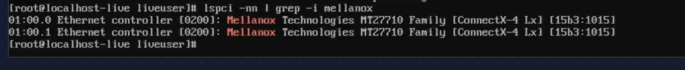

Both ports detected. Device ID `15b3:1015` — that's the ConnectX-4 Lx. The `mlx5_core` driver loads automatically with the full module tree:

```
# lsmod | grep mlx5
mlx5_core   3174400  2  mlx5_fwctl,mlx5_ib
mlx5_ib      561152  0
mlx5_fwctl    16384  0
```

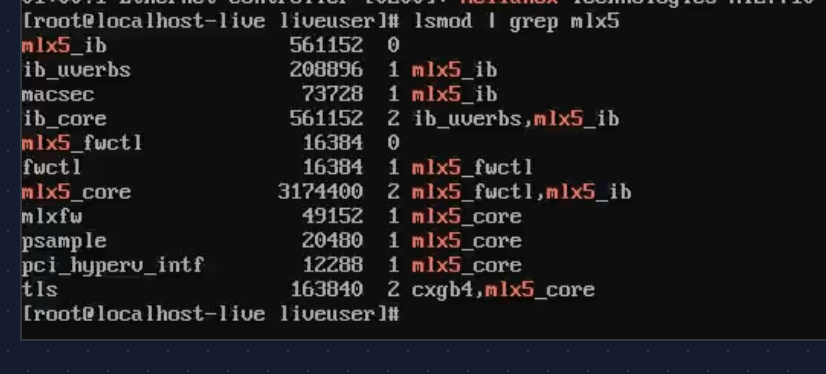

Kernel dmesg confirms both ports came up during boot:

```
mlx5_core 0000:01:00.0 enp1s0f0np0: Link up
mlx5_core 0000:01:00.1 enp1s0f1np1: Link up
e1000e 0000:00:1f.6 enp0s31f6: NIC Link is Up 1000 Mbps Full Duplex
```

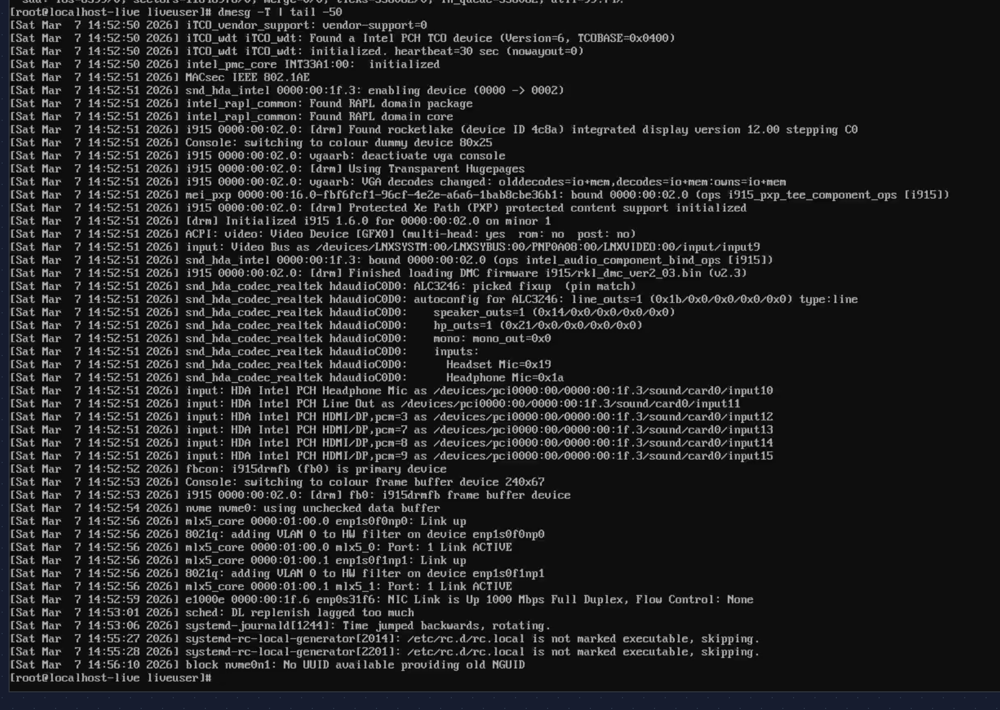

All three interfaces are UP:

```
# ip -br link | grep -E "ens|enp"
enp0s31f6      UP   d0:8e:79:05:37:0a
enp1s0f0np0    UP   ec:0d:9a:75:a5:d8
enp1s0f1np1    UP   ec:0d:9a:75:a5:d9
```

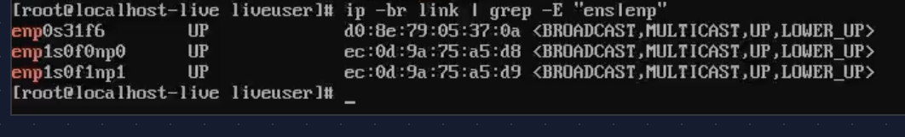

### PCIe lane negotiation

This is where SFF builds often have surprises. The CX4121C supports PCIe 3.0 x8. Does the OptiPlex 5090 SFF give it full width?

```
# lspci -vv -s $PCI_ADDR | grep -E "LnkCap|LnkSta"
LnkCap: Port #0, Speed 8GT/s, Width x8, ASPM L1, Exit Latency L1 <4us
LnkSta: Speed 8GT/s, Width x8
```

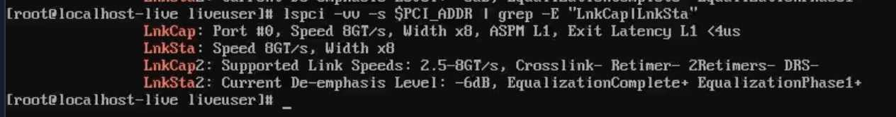

Full width. 8GT/s (PCIe 3.0), x8, no "(downgraded)" warnings. That's ~8 GB/s of PCIe bandwidth — plenty for dual 25 GbE (which tops out at ~6.25 GB/s aggregate).

<Callout title="If you see downgraded width" variant="warning">
  If LnkSta shows x4 or x1, reseat the card. The SFF riser's contact pressure can be tight. PCIe 3.0 x4 would still handle 10 GbE but would bottleneck Ceph under heavy replication.
</Callout>

### Link speed and transceiver

Both ports auto-negotiate to 10 Gbps (the CRS317's SFP+ cages cap at 10 GbE; the CX4121C's SFP28 ports are backward-compatible):

```
# ethtool enp1s0f0np0
Settings for enp1s0f0np0:
    Speed: 10000Mb/s
    Duplex: Full
    Port: Direct Attach Copper
    Auto-negotiation: on
    Link detected: yes

# ethtool -m enp1s0f0np0
    Transceiver type:     Extended: 25G Base-CR CA-N
    Length (Copper):      1m
    Vendor name:          MikroTik
    Vendor PN:            XS+DA0001
```

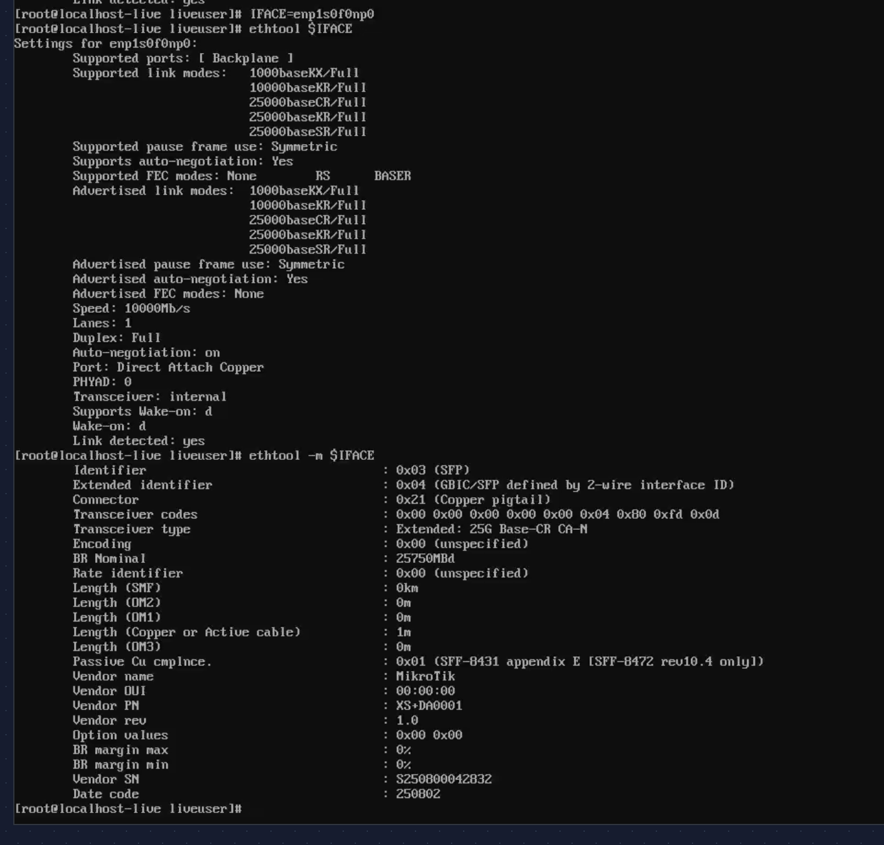

MikroTik XS+DA0001: 25G Base-CR CA-N, 1 meter passive copper DAC. At this length, no signal issues. Port 2 shows identical results:

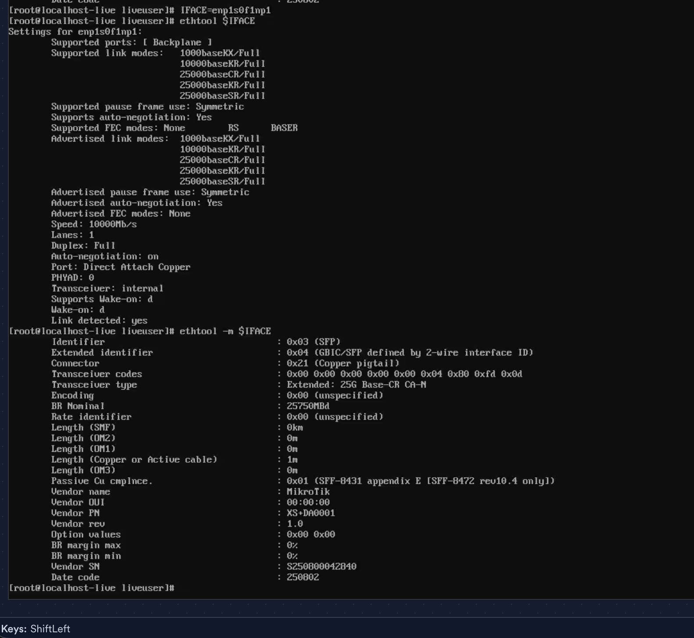

### Firmware and device identity

```
# ethtool -i enp1s0f0np0 | grep -E "driver|version|firmware"
driver: mlx5_core
version: 6.12.0-136.el10.x86_64
firmware-version: 14.32.2004 (DEL2420110034)

# mstconfig -d $PCI_ADDR query 2>/dev/null | head -10
Device type:     ConnectX4LX
Name:            0Z0NJD_OMRTOD_Ax
Description:     Mellanox 25GBE 2P ConnectX-4 Lx Adapter
```

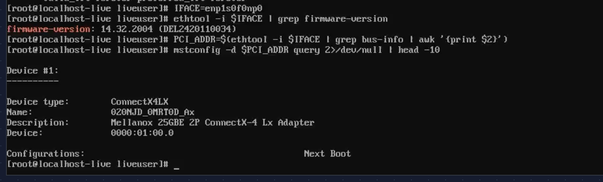

Firmware 14.32.2004 — Dell OEM build. Current, no upgrade needed. The part number (0Z0NJD, sold as Dell 20NJD) confirms this is the Dell-branded CX4121C.

## Onboard NIC and basic connectivity

The onboard Intel NIC (`enp0s31f6`) handles management traffic and OKD cluster networking:

```
# ethtool enp0s31f6 | grep -E "Speed|Link detected"
Speed: 1000Mb/s
Link detected: yes

# ip addr show enp0s31f6
inet 192.168.1.71/16 scope global dynamic enp0s31f6

# ping -c 3 192.168.1.1
3 packets transmitted, 3 received, 0% packet loss
rtt min/avg/max/mdev = 0.122/0.174/0.210/0.037 ms

# ping -c 3 8.8.8.8
3 packets transmitted, 3 received, 0% packet loss
rtt min/avg/max/mdev = 15.618/15.732/15.848/0.093 ms
```

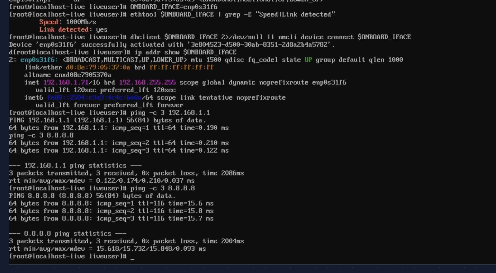

DHCP lease from the CCR2004, sub-millisecond latency to the gateway, ~16 ms to Google DNS. The management network works.

## Memory and CPU

```
# free -h
       total   used   free   shared  buff/cache  available
Mem:    62Gi   1.6Gi  61Gi   237Mi    715Mi       60Gi
```

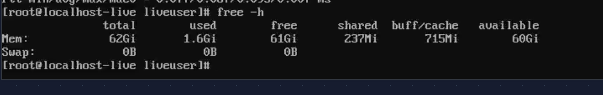

```
# dmidecode -t memory | grep -E "Size|Speed|Locator|Type:"
Size: 32 GB    Locator: DIMM1    Type: DDR4    Speed: 3200 MT/s
Size: No Module Installed    Locator: DIMM3
Size: No Module Installed    Locator: DIMM4
Size: 32 GB    Locator: DIMM2    Type: DDR4    Speed: 3200 MT/s
```

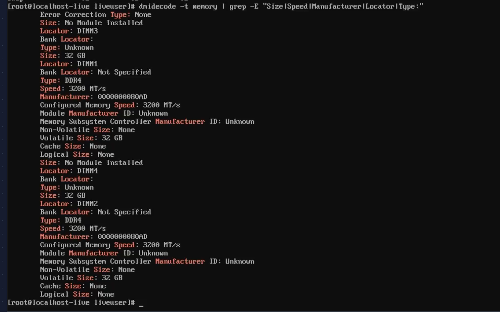

2 x 32 GB DDR4-3200 in DIMM1 and DIMM2 — dual channel. DIMM3 and DIMM4 empty, room to double to 128 GB if needed.

```
# lscpu | grep -E "Model name|Socket|Core|Thread|Virtualization"
Model name:         11th Gen Intel(R) Core(TM) i7-11700 @ 2.50GHz
Thread(s) per core: 2
Core(s) per socket: 8
Socket(s):          1
Virtualization:     VT-x
```

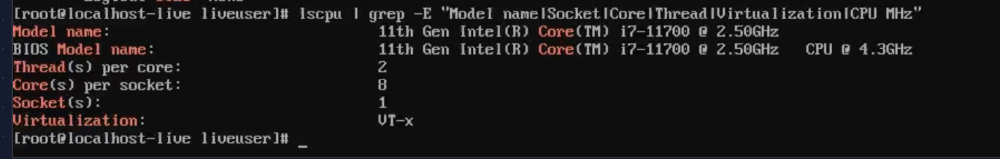

`vmx` flag present in `/proc/cpuinfo`, and DMAR/IOMMU fully initialized:

```
# dmesg | grep -i -E "IOMMU|DMAR"
ACPI: DMAR 0x0000000063FFD000 000088 (v02 INTEL  Dell Inc)
DMAR: Host address width 39
iommu: Default domain type: Translated
```

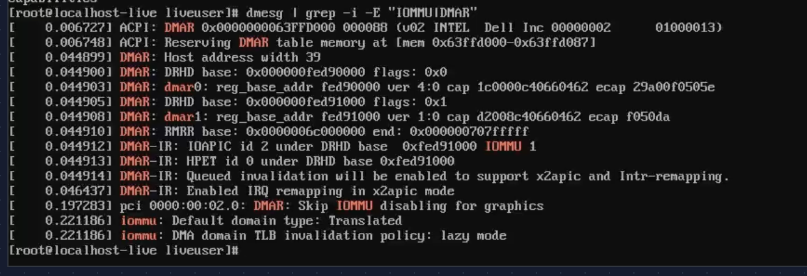

VT-d is working. Required for SR-IOV on Nodes 7-8 in Phase 2, but good to confirm now.

## Throughput test — 9.41 Gbps through the switch

The final check: can the Mellanox NIC push line-rate traffic through the CRS317? This isn't a loopback test — it's a real path through the switch fabric.

Mac mini on CRS317 sfp-sfpplus12 (10 GbE RJ45). Node 4 on sfp-sfpplus2 (10 GbE DAC). Both ports in the switch's bridge. iperf2 with 8 parallel TCP streams, 30 seconds:

**Node 4 (client):**

```
# iperf -c 192.168.1.74 -P 8 --sum-only -t 30
[SUM] 0.00-30.02 sec  32.9 GBytes  9.41 Gbits/sec
```

**Mac mini (server):**

```
[SUM] 0.00-30.01 sec  32.9 GBytes  9.42 Gbits/sec
```

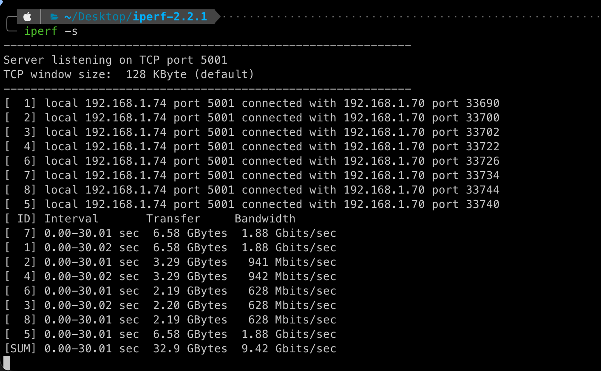

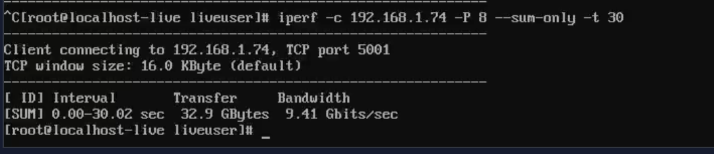

9.41 Gbps — 94% of the 10 GbE theoretical max. Essentially line rate after TCP overhead. The CRS317's Marvell Prestera ASIC is forwarding at wire speed.

This is the path Ceph replication traffic takes in Phase 1. It works.

## Kernel and driver versions (for the record)

```
# uname -r
6.12.0-136.el10.x86_64

# modinfo mlx5_core | grep -E "^version|^filename"
filename:  /lib/modules/6.12.0-136.el10.x86_64/kernel/drivers/net/ethernet/mellanox/mlx5/core/mlx5_core.ko.xz

# modinfo nvme | grep -E "^version|^filename"
filename:  /lib/modules/6.12.0-136.el10.x86_64/kernel/drivers/nvme/host/nvme.ko.xz
version:   1.0

# modinfo ahci | grep -E "^version|^filename"
filename:  /lib/modules/6.12.0-136.el10.x86_64/kernel/drivers/ata/ahci.ko.xz
version:   3.0
```

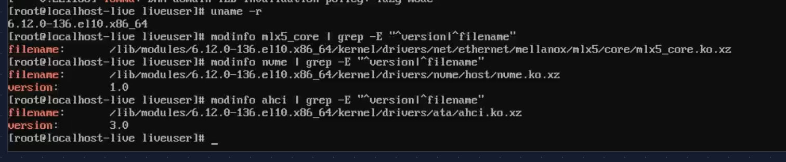

Worth recording. When SCOS 10 ships a different kernel version, I'll want to compare driver behavior.

## Go / no-go

Every check passed:

| # | Check | Result | Detail |
|---|-------|--------|--------|
| 1 | Three drives detected simultaneously | PASS | Intel S3610 + PNY CS1030 + WDC 4TB |
| 2 | SMART health — boot SSD | PASS | 0 reallocated, 34.6K hours, MLC wear minimal |
| 3 | SMART health — NVMe | PASS | 0% used, 3 hours (new) |
| 4 | SMART health — HDD | PASS | 0 reallocated, 48.8K hours |
| 5 | Concurrent I/O — no bus conflicts | PASS | All drives 99.7% util, zero errors |
| 6 | Mellanox CX4121C detected (15b3:1015) | PASS | Both ports, mlx5_core loaded |
| 7 | PCIe 3.0 x8 — no downgrade | PASS | LnkSta: Speed 8GT/s, Width x8 |
| 8 | Link speed — 10 Gbps | PASS | Both ports, MikroTik DAC detected |
| 9 | Onboard NIC — DHCP, gateway, internet | PASS | 1 Gbps, 0% loss |
| 10 | Throughput — near line rate | PASS | 9.41 Gbps through CRS317 |
| 11 | Memory — 64 GB DDR4-3200, dual channel | PASS | DIMM1 + DIMM2, slots 3-4 free |
| 12 | CPU — i7-11700, VT-x, VT-d | PASS | 8C/16T, IOMMU active |

<Callout title="Result: GO" variant="tip">
  This hardware is ready for OKD.
</Callout>

## What's next

Hardware is proven. The next post covers OKD SNO deployment on this validated machine — DNS pitfalls, installer gotchas, and platform-specific workarounds that the official docs don't mention.
