import Callout from '@/components/Callout.astro'

The hardware is [validated](/blog/homelab-validation/hardware). The network stack is [configured](/blog/homelab-network-impl/phase0). Time to install OKD 4.20 on a single Dell OptiPlex 5090 SFF and see if everything actually works together.

This post covers Stage 0: deploying OKD 4.20 (SCOS) as a Single Node OpenShift cluster using the agent-based installer. It includes the DNS chain that broke twice, the installer method that doesn't work, the VIP addresses that nobody listens on, and the 34 cluster operators that eventually all turned green.

## The plan

One node, one cluster, one purpose: prove that OKD 4.20 installs and runs on this hardware before ordering two more nodes for Phase 1. Specifically:

- OKD 4.20.0-okd-scos.17 (latest z-stream)
- Agent-based installer (ISO boot, no helper machine)
- `platform: none` (no bare-metal provisioning infrastructure)
- All 34 cluster operators healthy
- Backnet (VLAN 10) storage path validated through the CRS317 switch
- etcd on the Intel D3-S3610 boot SSD without slow-disk warnings

## Prerequisites: DNS and the chain nobody documents

The MikroTik network stack from the [previous post](/blog/homelab-network-impl/phase0) is already in place. What's left is DNS — and this is where the first hour went sideways.

OKD needs three DNS records: `api.<cluster>.<domain>`, `api-int.<cluster>.<domain>`, and a wildcard `*.apps.<cluster>.<domain>`. For SNO with `platform: none`, all three must point at the node's IP (`192.168.1.7`) because there's no keepalived to manage VIP addresses.

The DNS chain in this setup:

```
Node (192.168.1.7) → Pi-hole (192.168.1.12) → ??? → Router (192.168.1.1) → static records
```

The "???" is the problem. Pi-hole uses OpenDNS as its upstream resolver. It never queries the MikroTik router for local zones. So even though the router has correct records for `api.sno.home.lab`, the node asks Pi-hole, Pi-hole asks OpenDNS, and OpenDNS has no idea what `sno.home.lab` is.

**The fix:** Pi-hole conditional forwarding. One line in the Pi-hole DNS settings tells it to forward all `home.lab` queries to the router:

```
true,192.168.1.0/24,192.168.1.1,home.lab
```

After that, the chain works:

```
Node → Pi-hole → Router → static records → 192.168.1.7
```

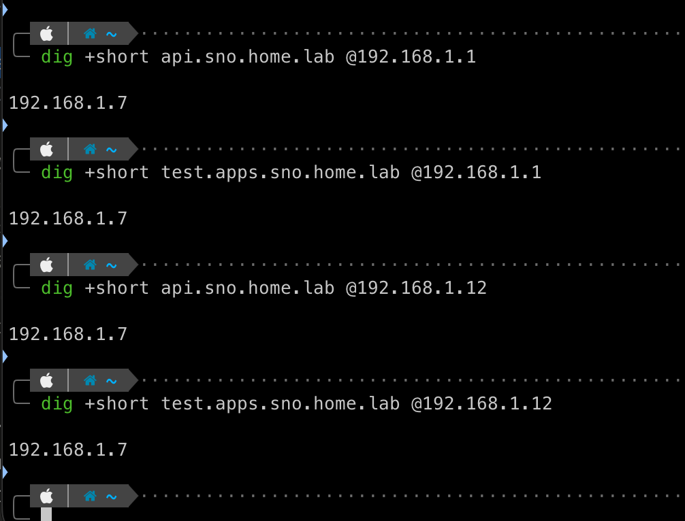

<Callout title="Don't add OKD records in Pi-hole's Local DNS" variant="warning">
  Pi-hole's Local DNS records override conditional forwarding. If you add `api.sno.home.lab` in the web UI *and* on the router, the Pi-hole entry wins. Later when you change the router record, Pi-hole serves the stale value. Keep the router as the single source of truth for `*.home.lab`.
</Callout>

## Building the agent ISO

The agent-based installer generates a self-contained ISO with the Assisted Service embedded — no helper machine, no podman containers, no external dependencies during install.

Two YAML files go in: `install-config.yaml` and `agent-config.yaml`. The ISO generation requires `openshift-install` (Linux x86_64 only) and `nmstatectl` (Fedora/RHEL only). On a Mac, you can't run either.

<Callout title="Do NOT use the podman-based assisted-service" variant="important">
  The guide at `github.com/openshift/assisted-service/deploy/podman` is obsolete for OKD 4.20. It tries to pull `quay.io/edge-infrastructure/assisted-installer-agent:latest` — an OCP-aligned image that doesn't exist for OKD. The OKD website's own page for this method warns it "won't produce a working system." Use the agent-based installer instead.
</Callout>

### install-config.yaml

```yaml
apiVersion: v1
baseDomain: home.lab
metadata:
  name: sno
compute:
  - name: worker
    replicas: 0
controlPlane:
  name: master
  replicas: 1
networking:
  networkType: OVNKubernetes
  clusterNetwork:
    - cidr: 10.128.0.0/14
      hostPrefix: 23
  serviceNetwork:
    - 172.30.0.0/16
  machineNetwork:
    - cidr: 192.168.1.0/24
platform:
  none: {}
pullSecret: '<your-pull-secret-json>'
sshKey: 'ssh-ed25519 AAAA... okd-homelab'
```

### agent-config.yaml

```yaml
apiVersion: v1beta1
kind: AgentConfig
metadata:
  name: sno
rendezvousIP: 192.168.1.7
hosts:
  - hostname: sno.home.lab
    role: master
    interfaces:
      - name: enp0s31f6
        macAddress: D0:8E:79:05:37:0A
    networkConfig:
      interfaces:
        - name: enp0s31f6
          type: ethernet
          state: up
          ipv4:
            enabled: true
            address:
              - ip: 192.168.1.7
                prefix-length: 24
            dhcp: false
          ipv6:
            enabled: false
      dns-resolver:
        config:
          server:
            - 192.168.1.12
      routes:
        config:
          - destination: 0.0.0.0/0
            next-hop-address: 192.168.1.1
            next-hop-interface: enp0s31f6
```

I built the ISO from Node 1 (the old Kubernetes node running Ubuntu) using a Fedora container. One command handles everything:

```bash
sudo podman run --rm -it -v $(pwd):/work -w /work fedora:latest bash -c '
  dnf install -y nmstate tar gzip &&
  curl -sL https://github.com/okd-project/okd/releases/download/4.20.0-okd-scos.17/openshift-client-linux-4.20.0-okd-scos.17.tar.gz \
    | tar xz -C /usr/local/bin &&
  oc adm release extract --command=openshift-install \
    quay.io/okd/scos-release:4.20.0-okd-scos.17 &&
  cp install-config.yaml agent-config.yaml install/ &&
  ./openshift-install agent create image --dir install --log-level=debug
'
```

882 MB ISO, built in about 8 minutes. The installer extracted the SCOS base ISO from the release payload, validated the NMState config, and embedded everything into a single bootable image.

After generation, the working directory looks like this:

```
okd-cluster/
├── agent-config.yaml
├── install-config.yaml
├── openshift-install
└── install/
    ├── agent.x86_64.iso        # 882 MB — the bootable image
    ├── rendezvousIP             # contains "192.168.1.7"
    └── auth/
        ├── kubeadmin-password   # generated admin password
        └── kubeconfig           # cluster admin credentials
```

The `install/auth/` directory is created during ISO generation, not after install completes. The kubeconfig and kubeadmin password are embedded in the ISO and available immediately — you don't need to wait for the cluster to come up to get them.

<Callout title="Interface names must match exactly" variant="warning">
  The NMState config in `agent-config.yaml` requires the exact Linux interface name. On the Dell OptiPlex 5090 SFF, the onboard Intel NIC shows as `enp0s31f6`, not `eno1` or `enp1s0`. The `next-hop-interface` in the route config must match this exactly. If it doesn't, `nmstatectl` fails with "next hop interface not found" and no ISO is generated.
</Callout>

## Boot and install

The agent ISO goes onto the JetKVM's storage and gets mounted as virtual media — no USB drive needed.

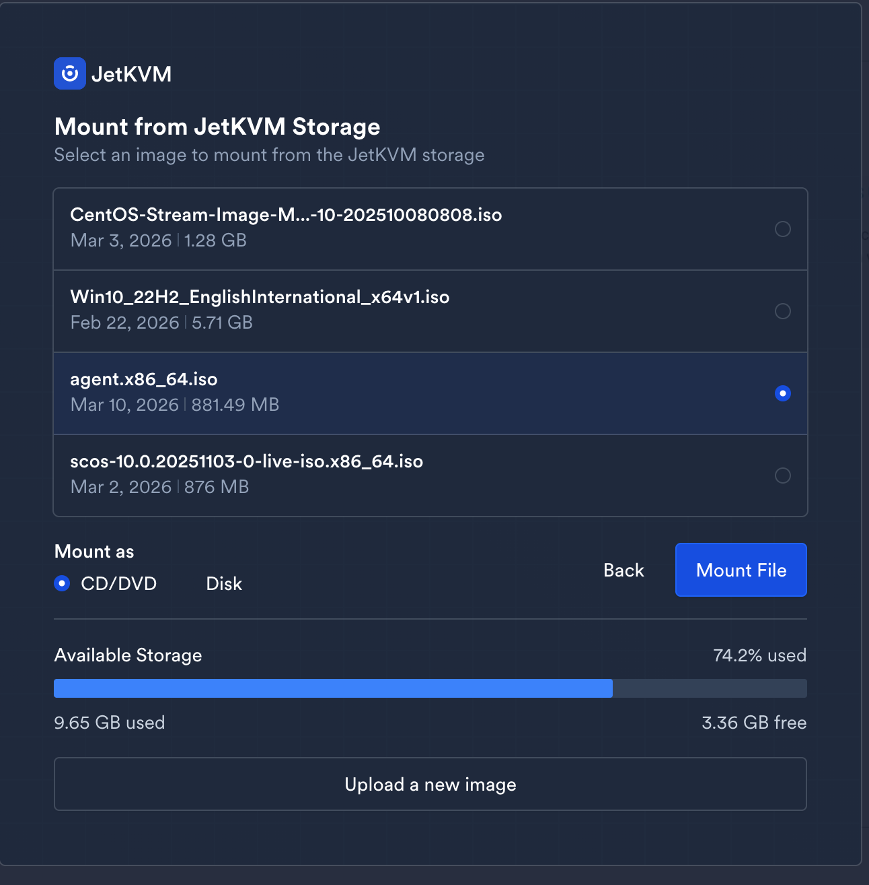

Boot device selection via JetKVM's browser interface. The Dell BIOS shows both the JetKVM USB emulation device and the existing UEFI entries. Select the JetKVM device.

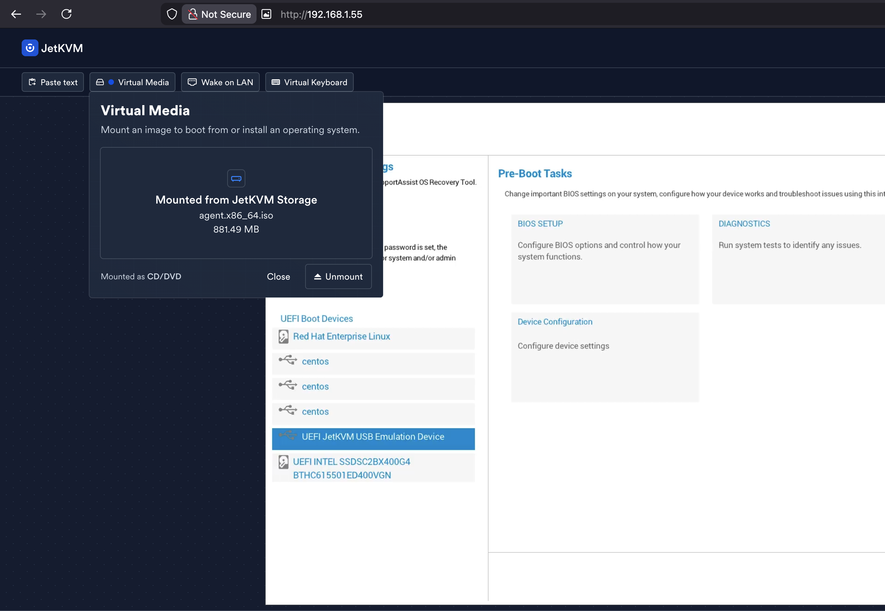

SCOS boots, Ignition config gets applied, and the node announces itself as the rendezvous host:

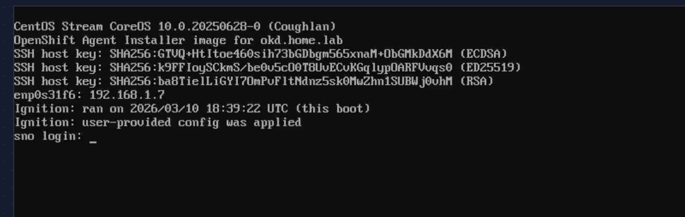

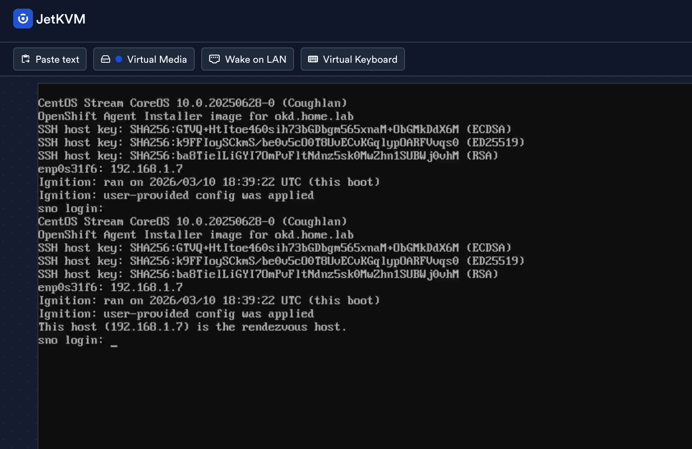

The Assisted Service containers start activating. The console shows "Waiting for services" while the agent service registers the cluster and validates the host:

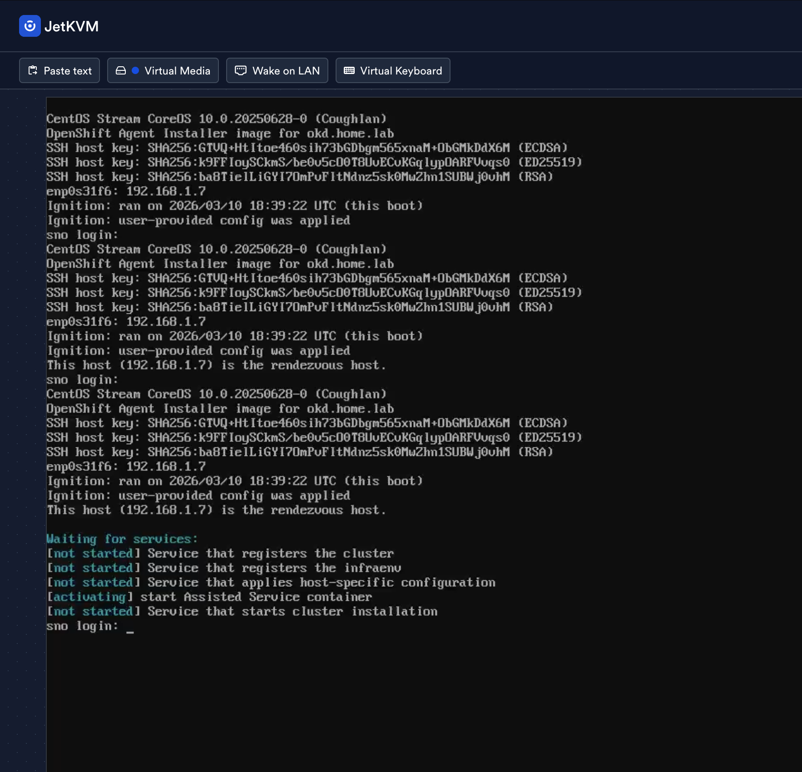

## The install: what the console actually looks like

With `openshift-install agent wait-for bootstrap-complete` running on Node 1, you get a split-screen view: the JetKVM console on the left showing the node's progress, and the installer output on the right showing validation status.

The host goes through several stages: discovering → insufficient (NTP sync pending) → known → preparing → installing. The NTP sync warning is transient — it resolves within a minute as the node reaches pool.ntp.org.

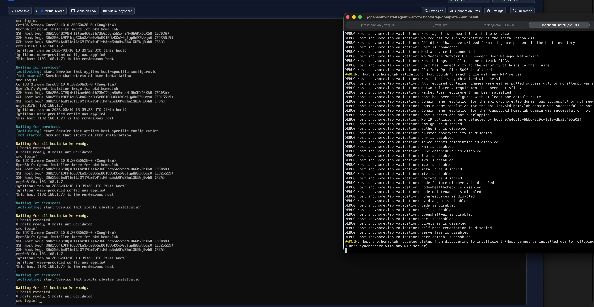

The validation output confirms everything you'd want to see from a bare-metal install:

```
Platform OptiPlex 5090 is allowed
Sufficient CPU cores for role master
Sufficient RAM for role master
Domain name resolution for the api.sno.home.lab domain was successful
Host has been configured with at least one default route
```

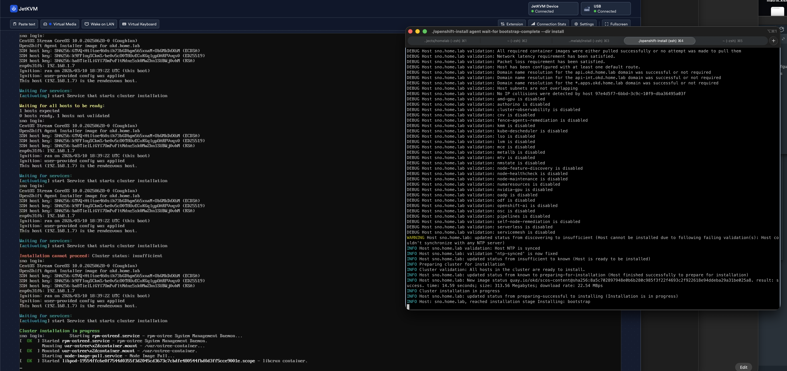

The SCOS image downloads from quay.io at ~24 MB/s (limited by the 1 GbE onboard NIC, not the internet connection):

```
New image status quay.io/okd/scos-content@sha256:8a5c...
result: success. time: 13.37 seconds; size: 313.56 Megabytes; download rate: 24.58 MBps
```

Then it's a long wait. The node writes the image to disk, reboots, and bootstraps. The `wait-for bootstrap-complete` command sits in a loop printing "Bootstrap Kube API never initialized" every 30 seconds for about 30 minutes while the node does its work.

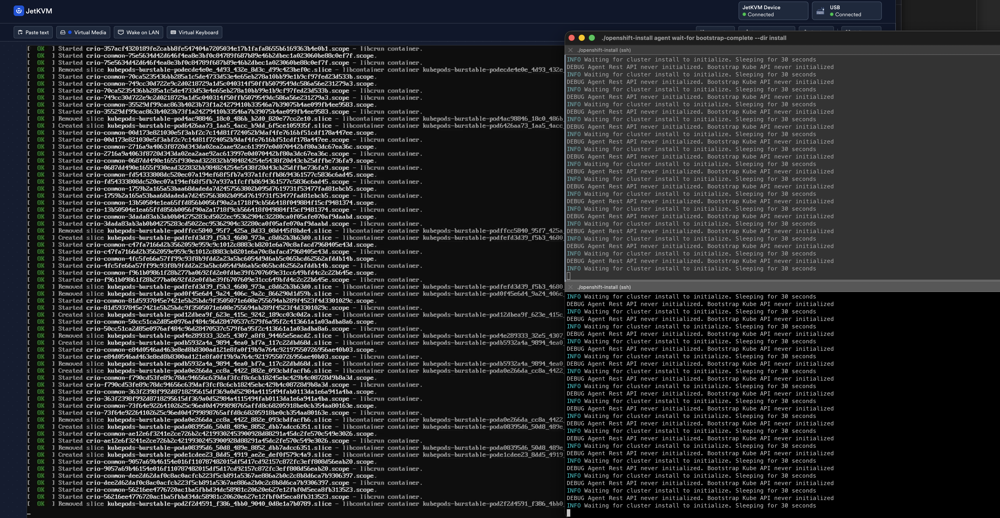

Bootstrap eventually completes:

```
INFO Bootstrap Kube API Initialized
INFO Bootstrap configMap status is complete
INFO Bootstrap is complete
INFO cluster bootstrap is complete
```

Then `wait-for install-complete` takes over and watches the 960 manifests get applied. Cluster operators come up one by one — from 0% to 68%, back to 0% (API server restart), back up to 67%, and eventually all the way through.

```bash
./openshift-install agent wait-for install-complete --dir install --log-level=debug
```

In my case, this command timed out after ~70 minutes because the ingress canary check was failing (more on that below). The cluster was functional — the timeout is just the installer giving up on waiting for all operators to report healthy. The error output tells you to troubleshoot and re-run the command:

```
ERROR Cluster operator ingress is degraded: timed out waiting for the condition
ERROR The 'wait-for install-complete' subcommand can then be used to continue the installation
```

### Connecting to the cluster

Once bootstrap completes, the cluster is accessible. Two ways in:

**Via kubeconfig (CLI):**

```bash
export KUBECONFIG=install/auth/kubeconfig
oc get nodes
oc get co
```

**Via web console (browser):**

```bash
# Console URL
oc whoami --show-console
# https://console-openshift-console.apps.sno.home.lab

# Admin password
cat install/auth/kubeadmin-password
```

Open the console URL in a browser, login as `kubeadmin` with the password from the file. Both methods use the credentials generated during ISO creation — they're in `install/auth/` from the moment you built the ISO.

## The DNS lesson (again)

My first attempt failed with:

```
ERROR dial tcp: lookup api.okd.home.lab on 192.168.1.12:53: no such host
```

This was the `metadata.name` mismatch. My `install-config.yaml` had `name: sno`, but the installer was trying to resolve `api.okd.home.lab`. Turns out I had an old set of DNS records from a previous attempt pointing at a different cluster name. The fix was straightforward once I realized the cluster name in the YAML determines the DNS prefix — `name: sno` means `api.sno.home.lab`, period.

The second DNS failure was the Pi-hole conditional forwarding issue described above. After fixing both, the third attempt worked.

<Callout title="metadata.name = DNS prefix" variant="important">
  If `install-config.yaml` says `name: sno`, the installer expects `api.sno.home.lab`. If DNS has `api.okd.home.lab`, bootstrap times out with "no such host." These must match. Decide on your cluster name before creating DNS records.
</Callout>

## VIPs and platform: none

The minimal network config from the [previous post](/blog/homelab-network-impl/phase0) had OKD VIPs at `.253` and `.254` on Frontnet. That works for a multi-node cluster where keepalived manages those addresses. For SNO with `platform: none`, there is no keepalived — the API and ingress bind directly on the node's actual IP (`.7`).

DNS records pointing to `.253/.254` result in:

```
ERROR dial tcp 192.168.1.253:6443: connect: no route to host
```

Because nothing listens there. The fix: point all DNS at the node IP.

## 34 operators, zero degraded

After applying the canary hairpin workaround (more on that below), every operator came up clean:

```
$ oc get co
NAME                                       VERSION              AVAILABLE   PROGRESSING   DEGRADED
authentication                             4.20.0-okd-scos.17   True        False         False
baremetal                                  4.20.0-okd-scos.17   True        False         False
cloud-controller-manager                   4.20.0-okd-scos.17   True        False         False
cloud-credential                           4.20.0-okd-scos.17   True        False         False
cluster-autoscaler                         4.20.0-okd-scos.17   True        False         False
config-operator                            4.20.0-okd-scos.17   True        False         False
console                                    4.20.0-okd-scos.17   True        False         False
control-plane-machine-set                  4.20.0-okd-scos.17   True        False         False
csi-snapshot-controller                    4.20.0-okd-scos.17   True        False         False
dns                                        4.20.0-okd-scos.17   True        False         False
etcd                                       4.20.0-okd-scos.17   True        False         False
image-registry                             4.20.0-okd-scos.17   True        False         False
ingress                                    4.20.0-okd-scos.17   True        False         False
insights                                   4.20.0-okd-scos.17   True        False         False
kube-apiserver                             4.20.0-okd-scos.17   True        False         False
kube-controller-manager                    4.20.0-okd-scos.17   True        False         False
kube-scheduler                             4.20.0-okd-scos.17   True        False         False
kube-storage-version-migrator              4.20.0-okd-scos.17   True        False         False
machine-api                                4.20.0-okd-scos.17   True        False         False
machine-approver                           4.20.0-okd-scos.17   True        False         False
machine-config                             4.20.0-okd-scos.17   True        False         False
marketplace                                4.20.0-okd-scos.17   True        False         False
monitoring                                 4.20.0-okd-scos.17   True        False         False
network                                    4.20.0-okd-scos.17   True        False         False
node-tuning                                4.20.0-okd-scos.17   True        False         False
olm                                        4.20.0-okd-scos.17   True        False         False
openshift-apiserver                        4.20.0-okd-scos.17   True        False         False
openshift-controller-manager               4.20.0-okd-scos.17   True        False         False
openshift-samples                          4.20.0-okd-scos.17   True        False         False
operator-lifecycle-manager                 4.20.0-okd-scos.17   True        False         False
operator-lifecycle-manager-catalog         4.20.0-okd-scos.17   True        False         False
operator-lifecycle-manager-packageserver   4.20.0-okd-scos.17   True        False         False
service-ca                                 4.20.0-okd-scos.17   True        False         False
storage                                    4.20.0-okd-scos.17   True        False         False
```

All 34 Available, all False on Degraded and Progressing. The cluster is running on SCOS 10 (kernel 6.12.x) with Kubernetes 1.33.5 and CRI-O 1.33.4:

```
$ oc get no -o wide
NAME           STATUS   ROLES                         VERSION   OS-IMAGE
sno.home.lab   Ready    control-plane,master,worker   v1.33.5   CentOS Stream CoreOS 10.0.20251023-0
```

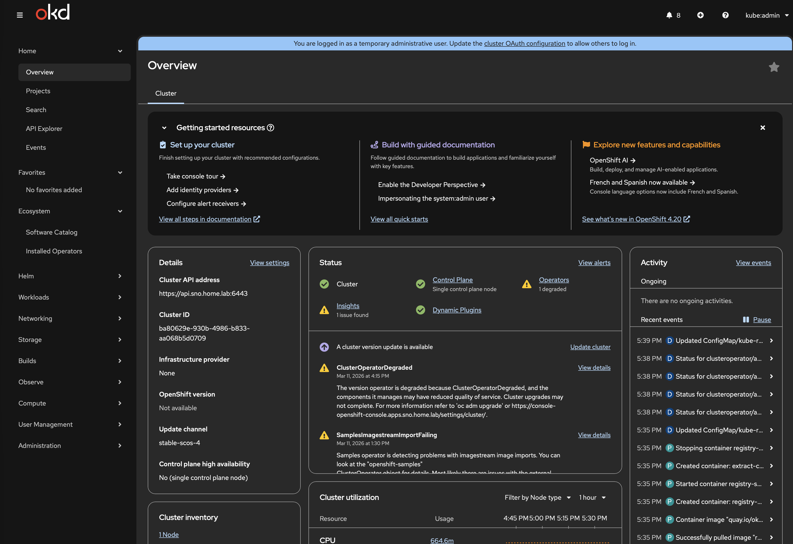

## The ingress canary hairpin problem

The one operator that didn't come up clean initially was ingress. The canary health check — which tests that the ingress router can serve traffic — times out because the node can't reach its own external IP (`192.168.1.7`) through OVN.

Traffic via `127.0.0.1` works fine. Traffic via the external IP does not. The canary route resolves to the external IP, so the health check fails.

Workaround:

```bash
sudo bash -c 'echo "127.0.0.1 canary-openshift-ingress-canary.apps.sno.home.lab" >> /etc/hosts'
```

This is cosmetic — all actual ingress routing works correctly. The console, OAuth, monitoring routes are all accessible from external clients. Only the self-test fails. The `/etc/hosts` entry doesn't persist across reboots on SCOS, but for SNO validation purposes it's sufficient.

## Monitoring and etcd health

Prometheus has 69 active scrape targets. The monitoring stack is fully operational:

```
$ oc get pods -n openshift-monitoring
alertmanager-main-0                                      6/6     Running
cluster-monitoring-operator                              1/1     Running
kube-state-metrics                                       3/3     Running
prometheus-k8s-0                                         6/6     Running
prometheus-operator                                      2/2     Running
prometheus-operator-admission-webhook                    1/1     Running
metrics-server                                           1/1     Running
monitoring-plugin                                        1/1     Running
node-exporter                                            2/2     Running
openshift-state-metrics                                  3/3     Running
telemeter-client                                         3/3     Running
thanos-querier                                           6/6     Running
```

etcd reports healthy with a 3 ms commit latency:

```
$ etcdctl endpoint health --cluster
https://192.168.1.7:2379 is healthy: successfully committed proposal: took = 3.236162ms
```

A handful of `apply request took too long` warnings appear in the etcd logs — all read-only range operations at 200–255 ms, clustered around two timestamps during operator reconciliation. No `slow fdatasync` warnings, which is what you'd worry about on a boot SSD. The Intel D3-S3610 (MLC) is handling etcd's write patterns comfortably.

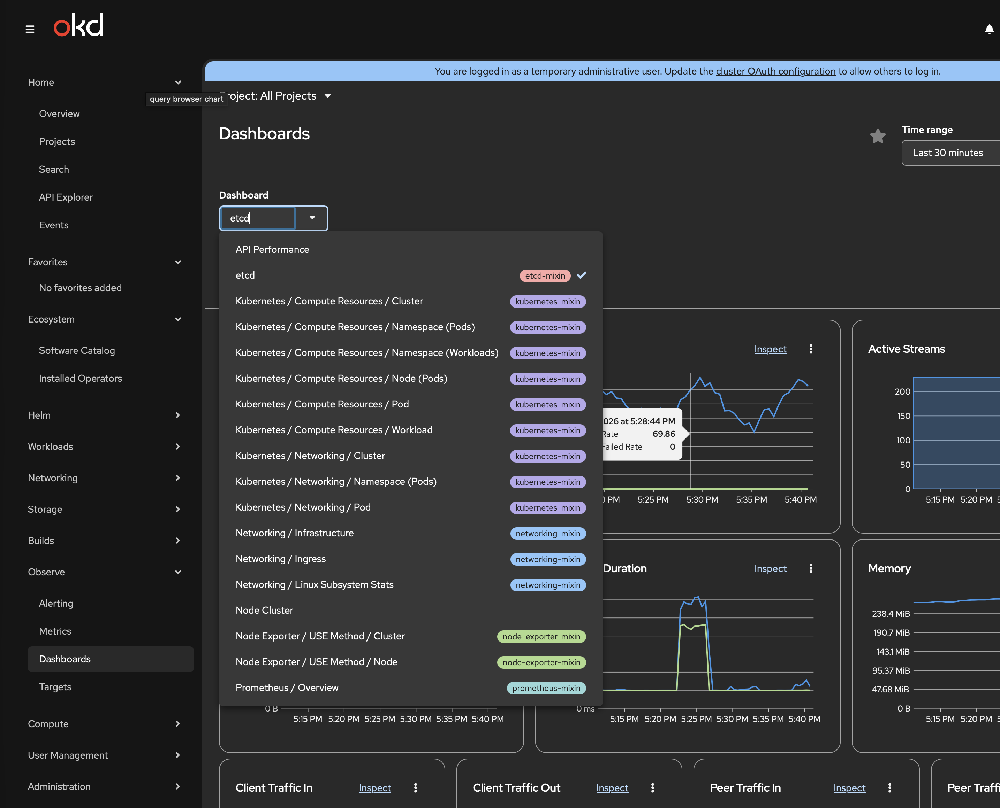

## Backnet (VLAN 10) storage path validation

The CX4121C Mellanox NIC has been sitting idle during the install — only the onboard Intel 1 GbE NIC was configured for OKD. Now I validate the storage network path that Ceph will use in Phase 1.

```
$ ssh core@192.168.1.7
$ ip -br link | grep -v -E "lo|ovs|br|veth|eno|enp0"
enp1s0f0np0      UP             ec:0d:9a:75:a5:d8
enp1s0f1np1      DOWN           ec:0d:9a:75:a5:d9
```

Two ports visible, `mlx5_core` driver loaded. Port 1 is UP (DAC connected to CRS317), port 2 is DOWN (no cable for SNO — second port is for LACP bonding in Phase 1).

Assign a temporary IP and test the path through the switch to the router:

```
$ sudo ip addr add 192.168.10.2/24 dev enp1s0f0np0
$ sudo ethtool enp1s0f0np0 | grep -E "Speed|Link"
	Speed: 10000Mb/s
	Link detected: yes

$ ping -c 5 -I enp1s0f0np0 192.168.10.1
PING 192.168.10.1 (192.168.10.1) from 192.168.10.2 enp1s0f0np0: 56(84) bytes of data.
64 bytes from 192.168.10.1: icmp_seq=1 ttl=64 time=0.153 ms
64 bytes from 192.168.10.1: icmp_seq=2 ttl=64 time=0.118 ms
64 bytes from 192.168.10.1: icmp_seq=3 ttl=64 time=0.084 ms
64 bytes from 192.168.10.1: icmp_seq=4 ttl=64 time=0.122 ms
64 bytes from 192.168.10.1: icmp_seq=5 ttl=64 time=0.109 ms

--- 192.168.10.1 ping statistics ---
5 packets transmitted, 5 received, 0% packet loss, time 4122ms
rtt min/avg/max/mdev = 0.084/0.117/0.153/0.022 ms
```

10 Gbps link, sub-millisecond latency, zero packet loss. The full L2/L3 path works: CX4121C → DAC → CRS317 sfp-sfpplus2 (VLAN 10 access port) → trunk to CCR2004 → VLAN 10 gateway (192.168.10.1).

This is the path Ceph replication traffic will use in Phase 1. It works.

## Lessons learned

Every one of these cost time during the install:

1. **The podman-based assisted-service is dead for OKD 4.20.** Don't follow the `github.com/openshift/assisted-service/deploy/podman` guide. It pulls OCP-aligned images that don't work with OKD. The agent-based installer (`openshift-install agent create image`) is the only supported method.

2. **openshift-install is Linux x86_64 only.** No macOS support. Apple Silicon Macs running podman with `--platform linux/amd64` stall on QEMU emulation. Build the ISO from any Linux x86_64 machine — even an old node with a Fedora container.

3. **nmstatectl is required and Fedora/RHEL only.** Not on macOS, not on Ubuntu. A Fedora container solves this cleanly.

4. **Interface names must match exactly in agent-config.yaml.** The Dell OptiPlex 5090 SFF onboard NIC is `enp0s31f6`. If your route config says `enp1s0`, NMState validation fails and no ISO is generated.

5. **metadata.name = DNS prefix.** If the YAML says `sno`, DNS must have `api.sno.home.lab`. No exceptions.

6. **Pi-hole doesn't forward to the router by default.** It goes straight to OpenDNS. Add conditional forwarding for your `home.lab` zone.

7. **platform: none means no VIPs.** No keepalived, no haproxy. Everything binds on the node IP. DNS must point at `.7`, not at `.253/.254`.

8. **Use the admin kubeconfig, not the node kubeconfig.** The file at `/etc/kubernetes/kubeconfig` on the node is the `node-bootstrapper` service account. It can't list cluster operators.

9. **RouterOS wildcard DNS needs address= type, not FWD.** The FWD record type forwards to another DNS server. For local wildcard resolution, use a regex record with `address=`.

10. **The ingress canary hairpin is cosmetic.** The node can't reach its own external IP through OVN. A `/etc/hosts` entry pointing the canary hostname to `127.0.0.1` clears the degradation. All real ingress works.

## Result: GO for Phase 1

All validation criteria pass:

| # | Criterion | Result |
|---|-----------|--------|
| 1 | Cluster version 4.20.0-okd-scos.17, Available, not Progressing | PASS |
| 2 | Node Ready, roles correct | PASS |
| 3 | All 34 operators Available, not Degraded | PASS (ingress canary workaround) |
| 4 | No unexpected failing pods | PASS |
| 5 | Web console accessible, kubeadmin login works | PASS |
| 6 | Monitoring stack operational (69 Prometheus targets) | PASS |
| 7 | etcd healthy, no slow fdatasync warnings | PASS |
| 8 | Backnet VLAN 10 path validated (10 Gbps, 0.117 ms avg) | PASS |

The single-node cluster is healthy. The hardware runs OKD without issues. etcd is comfortable on the MLC boot SSD. The storage network works end-to-end.

Time to order Nodes 5 and 6.

## What's next

This SNO gets wiped. Node 4 becomes the first member of a 3-node cluster in Phase 1. Before that:

- Revert DNS from `sno.home.lab` to `okd.home.lab` with VIP addresses
- Run Stage -1 pre-validation on each new node
- Configure LACP bonds on the CRS317 for dual-port storage networking
- Enable jumbo frames (MTU 9000) after bonds are stable
- Deploy Phase 1: 3-node OKD with Rook-Ceph distributed storage
