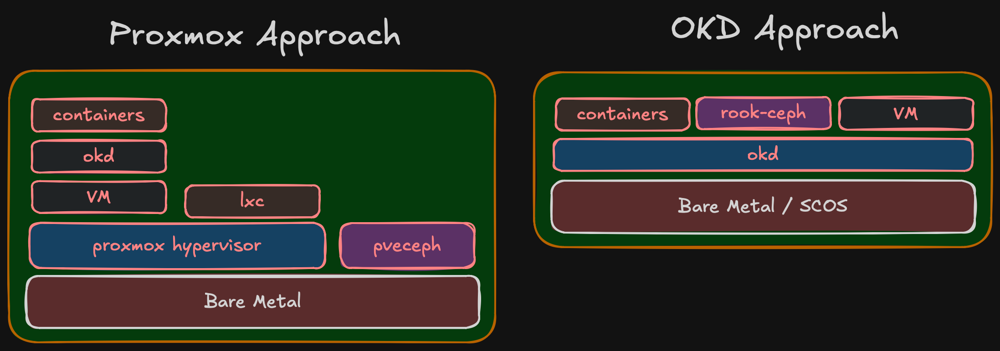

import Callout from '@/components/Callout.astro'

Most homelab content starts the same way: "I just picked up this server on eBay, let me show you what I'm running on it." Hardware first, purpose second — if a purpose ever shows up at all.

This series is going to be different.

Over the next several posts, I'll walk through building a production-grade bare-metal OKD cluster from scratch. But before any hardware, network topology, or storage architecture — let's start with *why*.

## The starting point: one little box

My current setup is a single Dell OptiPlex 7050 Micro running vanilla Kubernetes. Quad-core, limited RAM, one disk. For a while it worked — learned Kubernetes basics, ran some personal services, experimented with containers.

The problems showed up fast. One CPU, one disk, one NIC, no room to grow. No redundancy — node goes down, everything goes down. No distributed storage, no failover, no quorum.

Then there's the upgrade path. Vanilla Kubernetes on a single node means manually checking kubelet vs API server compatibility, verifying your CNI plugin supports the new version, making sure CSI drivers still work, confirming the container runtime defaults haven't changed. Every upgrade is a research project with no rollback if you get it wrong. On a multi-node platform with operator-managed lifecycle, those components get coordinated for you. On a single self-managed node, it's all on you.

Beyond the operational pain, there's a learning ceiling. You can read about etcd consensus, pod anti-affinity, and storage replication all day. But you don't really get it until you've seen a node drop out and watched workloads reschedule to surviving nodes.

## What I actually need

"Production-grade" for a homelab doesn't mean enterprise scale. It means enterprise discipline:

**A real cluster.** Multi-node = actual distributed consensus, pod scheduling across failure domains, network partitioning scenarios. Three nodes is the minimum for quorum, and that's where Phase 1 starts.

**Distributed storage that survives node failures.** Ceph running across nodes with real replication. Not NFS on a NAS pretending to be distributed.

**Network isolation.** Storage traffic, management traffic, IoT, external services — all on separate VLANs with firewall policies between them.

**Virtualization alongside containers.** Occasionally I'll need a VM for something that doesn't containerize. That should be managed by the same platform, not a separate hypervisor. More on this below.

**A platform I can learn from.** Not Plex in a container. Infrastructure that mirrors what I work with professionally, from physical cabling to storage class definitions.

## Hyperconverged, not monolithic

Two approaches to this kind of build:

**Monolithic:** Buy a beefy 1U/2U rack server, 128 GB RAM, hypervisor on top, carve out VMs. Simpler, quieter, one box to worry about. Many homelabs work this way.

**Hyperconverged (HCI):** Multiple small nodes, each with compute and storage onboard, working together as a cluster. Three SFF machines in Phase 1, expanding to five in Phase 2.

I went with HCI. The monolithic approach teaches you VM administration. HCI teaches you distributed systems — storage distributed via Ceph, networking that requires real segmentation, failure domains that are physical machines rather than VMs on the same host. When a node goes down in an HCI cluster, you see what your replication strategy actually does. When a VM goes down on a single hypervisor, you restart it.

More nodes means more hardware, more cables, more things that can fail. That's the point — it's what you deal with in production, at a scale you can wrap your head around.

## Kubernetes-native, not hypervisor-first

The traditional homelab stack for HCI is Proxmox: hypervisor layer, then VMs, then Kubernetes running inside VMs, with Ceph managed by Proxmox for storage. It works, but it's a stack of layers — each with its own management plane, its own upgrade lifecycle, its own failure modes.

Proxmox does have containers via LXC, but that's not comparable to Kubernetes. LXC gives you lightweight system containers — basically VMs without the hypervisor overhead. It doesn't give you pod scheduling, service discovery, rolling deployments, operator lifecycle, or any of the orchestration that makes Kubernetes useful. For running containers at scale, you need Kubernetes anyway — and then Proxmox becomes just a hypervisor hosting the VMs that run Kubernetes.

Proxmox also integrates Ceph, but it's not the full Ceph experience. Proxmox uses its own `pveceph` tooling (developed before `cephadm` existed), not the standard Ceph orchestrator. The RGW module (object storage) is omitted from Proxmox's dashboard package — you need to manually download and configure it. Erasure coded pools are CLI-only, not in the GUI. NFS-Ganesha and SMB gateways aren't managed at all. It's Ceph for VM disk images, not Ceph as a full storage platform.

I'm going the other direction: Kubernetes is the platform, running directly on bare metal. Containers are the primary workload — that's what I run day to day. When I occasionally need a VM (one or two lightweight VMs for something that doesn't containerize), OKD Virtualization (KubeVirt) handles it. VMs become Kubernetes resources — managed by the same API, same YAML, same GitOps pipelines. ArgoCD can deploy a VM the same way it deploys a Deployment. No separate hypervisor management interface.

There's also the portability argument. Kubernetes runs the same everywhere — cloud, edge, bare metal, VMs. The patterns, tooling, and skills transfer directly. A hypervisor doesn't give you that. What I learn building this homelab on OKD applies to any Kubernetes environment. What I'd learn on Proxmox applies to... Proxmox.

KubeVirt is a CNCF Incubating project, and it's the foundation of OKD Virtualization. It's relatively new compared to traditional hypervisors, so hands-on experience with it has real professional value — same as with Rook-Ceph.

The Proxmox approach makes sense if VMs are your primary workload and containers are secondary. For me it's the opposite — containers first, occasional VMs. Running an entire hypervisor layer to support 1-2 VMs doesn't justify the overhead.

<Callout title="Key point" variant="important">
  Same end state but Proxmox stacks 5 layers, OKD stacks 3. In OKD, containers/Rook-Ceph/VMs are peers at the same level. In Proxmox, OKD runs inside a VM, containers inside OKD.
</Callout>

## Why OKD?

If I only needed Kubernetes, there are simpler options — K3s, MicroK8s, kubeadm. But OKD gives you an opinionated, integrated platform.

I work with OpenShift daily. I know the operator model, the upgrade lifecycle, the monitoring stack, how it all fits together. Building a homelab on a different platform means context-switching between work and personal projects — two sets of patterns, two sets of tooling, two sets of failure modes. OKD lets me go deeper on the same stack I use professionally, while exploring layers that are normally hidden behind managed deployments.

OKD is the upstream community distribution of OpenShift. Operator framework, monitoring and logging, OAuth, image registry, OKD Virtualization. Runs on SCOS (CentOS Stream CoreOS), same operator lifecycle as OpenShift — without the subscription cost.

The whole platform stack is built on CNCF projects: Kubernetes for orchestration, KubeVirt (CNCF Incubating) for virtualization, Rook-Ceph (CNCF Graduated) for storage. This is deliberate — a Kubernetes-first platform where every component follows the same patterns, same API model, same operator lifecycle. No proprietary layers, no vendor lock-in. The skills and patterns transfer directly to any Kubernetes environment.

The trade-off: community support instead of enterprise support. For a learning environment, that's a feature — when something breaks, you fix it yourself.

## The principle behind the series

<Callout title="Core principle" variant="important">
  You cannot implement what you haven't designed, and you cannot design without a clear goal.
</Callout>

The homelab community has plenty of projects that started with an impulse purchase and grew into infrastructure held together by forum posts and hope. I've been there — the OptiPlex 7050 wasn't part of any plan.

This time: goal first, then design, then architecture, then BOM. Only after validating on a single node does full deployment start. That's how you avoid spending money on hardware that doesn't fit and networks that don't scale.

## What's coming

The series follows the actual decision sequence:

<Callout title="Series roadmap" variant="summary">
  1. **Why** — You're reading it.
  2. **Compute Architecture** — How many nodes, how much RAM, what storage tiers, failure domains, and why.
  3. **Network Architecture** — VLANs, 10 Gbps storage networking, and why the network is the foundation.
  4. **Storage Architecture** — Tiered Ceph with fast NVMe and slow HDD pools, replication strategies, Rook-Ceph.
  5. **Bill of Materials** — Real pricing from the Polish used market. What I chose, what I rejected, and compatibility surprises.
  6. **Validation** — Single-node testing before full commitment. BIOS config, SCOS boot, NIC compatibility, throughput verification.

  More posts will follow as the project evolves — deployment, day-2 ops, workload onboarding. The series grows with the infrastructure.
</Callout>

## Who this is for

This isn't a weekend Plex project. It's for engineers who want to understand how bare-metal Kubernetes comes together — from physical layer to pod scheduler — and want to see the decision-making process, not just the end result.

Planning your own homelab, studying for CKA/CKS, or just curious about bare-metal OKD — there should be something useful here.
