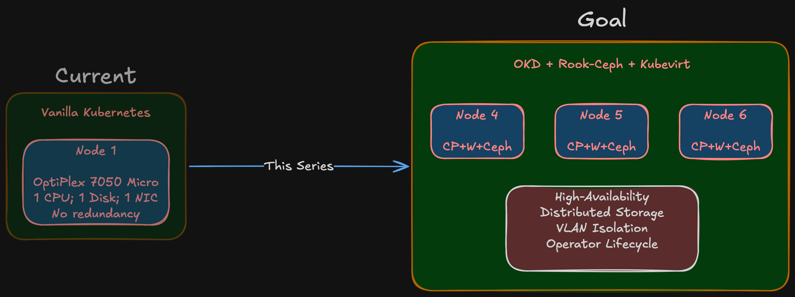
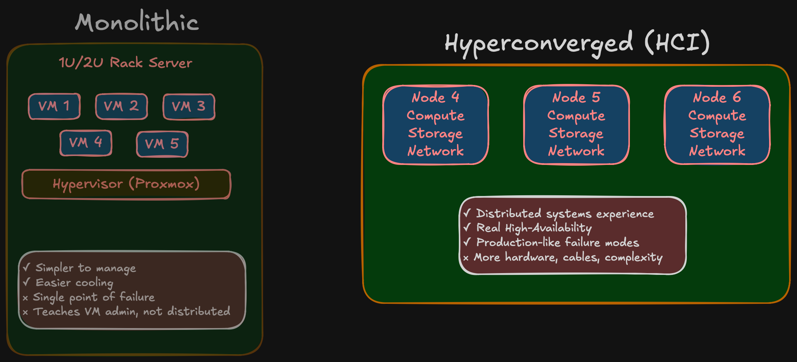

import Callout from '@/components/Callout.astro'

Most homelab content starts the same way: "I just picked up this server on eBay, let me show you what I'm running on it." Hardware first, purpose second — if a purpose ever shows up at all.

This series is going to be different.

Over the next several posts, I'm going to walk through how I'm building a production-grade bare-metal OKD cluster from the ground up. But before we talk about any hardware, any network topology, or any storage architecture, we need to start with the question that should come before every infrastructure decision: *why?*

## The starting point: one little box

My current setup is a single Dell OptiPlex 7050 Micro running vanilla Kubernetes. It's a fine little machine for what it is — a compact desktop with a quad-core processor and enough RAM to run a handful of containers. For a while, it did everything I needed: a place to learn Kubernetes fundamentals, run some personal services, and experiment with container orchestration.

But "for a while" is doing a lot of heavy lifting in that sentence.

The OptiPlex 7050 Micro has one CPU, one disk, one network interface, and no room to grow. There's no redundancy, no distributed storage, and no way to simulate the kind of failures that teach you the most about running infrastructure. When the node goes down — and it does — everything goes with it. There's no failover, no quorum, no recovery. Just silence and a blinking cursor.

Then there's the upgrade path — or rather, the lack of one. Vanilla Kubernetes upgrades on a single node are a manual, nerve-wracking process. You're responsible for making sure the kubelet version matches the API server, that your CNI plugin supports the new version, that your CSI drivers are compatible, that the container runtime hasn't changed its defaults. Every upgrade is a research project, and getting any of those moving parts wrong means downtime with no fallback. On a multi-node cluster with operator-managed lifecycle, that coordination happens for you. On a single self-managed node, it's all on you.

The more I worked with it, the clearer the limitations became. Not limitations of Kubernetes itself, but limitations of what a single node can teach you. You can read about etcd consensus, pod anti-affinity, and storage replication all day, but until you've watched a node drop out of a cluster and seen your workloads reschedule onto surviving nodes, you haven't really understood what those concepts mean.

## What I actually need

So what does "production-grade" mean for a homelab? It doesn't mean enterprise scale. It means enterprise *discipline*. Specifically, I need:

**A real cluster, not a simulation.** Multi-node means actual distributed consensus, actual pod scheduling across failure domains, and actual network partitioning scenarios. Three nodes is the minimum for a meaningful quorum — and that's where Phase 1 starts.

**Distributed storage that survives node failures.** Local disks are fine for ephemeral workloads, but anything persistent needs to survive hardware failure. That means Ceph, running across multiple nodes with real replication. Not a single NFS share on a NAS pretending to be distributed storage.

**Proper network isolation.** Production environments don't run everything on a flat network. Storage traffic, management traffic, IoT devices, and external-facing services all belong in separate network segments. That means VLAN segmentation, dedicated storage networking, and deliberate inter-VLAN firewall policies.

**Virtualization alongside containers.** The industry has largely settled on Kubernetes as the control plane for both containers and virtual machines. OKD Virtualization (KubeVirt) lets me run VMs as first-class Kubernetes resources — useful for workloads that don't fit neatly into containers.

**A platform I can actually learn from.** This isn't about running Plex in a container. It's about building the kind of infrastructure I work with professionally and understanding every layer of it — from the physical cabling to the storage class definitions.

## Hyperconverged, not monolithic

There are two ways to approach this kind of build. The monolithic route: buy a beefy 1U or 2U rack server with 128 GB of RAM, spin up a hypervisor, and carve out virtual machines for everything. It's simpler to manage, easier to cool, and gives you one box to worry about. Plenty of homelabs run this way.

I went the other direction — hyperconverged infrastructure. Multiple small form-factor nodes, each carrying both compute and storage, working together as a cluster. Three SFFs in Phase 1, expanding to five in Phase 2.

Why? Because the monolithic approach teaches you virtualization administration. The hyperconverged approach teaches you distributed systems. With HCI, storage is distributed across nodes via Ceph, networking requires real segmentation, and failure domains are physical machines — not VMs on the same host pretending to be independent. When a node goes down in an HCI cluster, you learn what your replication strategy actually does. When a VM goes down on a single hypervisor, you learn how to click "restart."

<Callout title="The trade-off" variant="warning">
  More nodes means more hardware to buy, more cables to run, more things that can fail. But that complexity is the point — it mirrors what you'd encounter in a real production environment, at a scale you can actually wrap your head around.
</Callout>

## Why OKD?

If all I needed was Kubernetes, there are simpler options. K3s, MicroK8s, even vanilla kubeadm. But OKD gives me something those distributions don't: an opinionated, integrated platform.

I work with OpenShift on a daily basis. I know the operator model, the upgrade lifecycle, the monitoring stack, the way everything fits together. Building a homelab on a completely different platform would mean context-switching between work and personal projects — learning two sets of patterns, two sets of tooling, two sets of failure modes. OKD lets me deepen the expertise I already use professionally, while also exploring the layers that are usually hidden behind a managed deployment.

OKD is the upstream community distribution of OpenShift. It includes the operator framework, integrated monitoring and logging, built-in OAuth, image registry, and the foundation for OKD Virtualization (KubeVirt). It runs on SCOS (CentOS Stream CoreOS), uses the same operator lifecycle as OpenShift, and gives me access to the same patterns and tooling that run in production environments — without the licensing cost that makes OpenShift impractical for a homelab.

<Callout title="Why Rook-Ceph instead of ODF?" variant="tip">
  OpenShift Data Foundation (ODF) is a Red Hat product that requires a subscription and isn't part of the OKD ecosystem. Rook-Ceph is the upstream operator that ODF is built on — same Ceph underneath, same operator model, no licensing strings attached. It integrates cleanly with OKD and gives the same tiered storage capabilities.
</Callout>

The trade-off is that OKD is community-supported, not Red Hat-supported. For a learning environment, that's not a trade-off — it's a feature. When something breaks, you fix it yourself. That's the whole point.

## The principle that drives everything

Here's the idea that shapes this entire series:

<Callout title="Core principle" variant="important">
  You cannot implement what you haven't designed, and you cannot design without a clear goal.
</Callout>

This sounds obvious. It isn't. The homelab community is full of projects that started with an impulse purchase and evolved into tangled infrastructure held together by forum posts and optimism. I've been there. The OptiPlex 7050 wasn't part of any plan — it was available, so I bought it, and then figured out what to do with it.

This time, the process is reversed. The goal comes first. The design follows from the goal. The architecture implements the design. The bill of materials serves the architecture. And only after validating the design on a single node does the full deployment begin.

That sequence isn't just project management methodology applied to a hobby. It's how you avoid spending real money on hardware that doesn't fit, networks that don't scale, and storage configurations that bottleneck under load. Every implementation detail in this series will trace back to a requirement established in the design phase.

## What's coming

This series follows the actual decision sequence of the project:

<Callout title="Series roadmap" variant="summary">
  1. **Why** — You're reading it. The motivation, the limitations, the goals.
  2. **Design** — Translating those goals into concrete specifications. How many nodes, how much RAM, what kind of storage, and why.
  3. **Network Architecture** — VLAN segmentation, 10 Gbps storage networking and why the network is the foundation everything else depends on.
  4. **Storage Architecture** — Tiered Ceph with fast NVMe and slow HDD pools, replication strategies, and how Rook-Ceph manages it all.
  5. **Bill of Materials** — Real pricing from the Polish used market. What I chose, what I rejected, and the compatibility surprises that saved me from expensive mistakes.
  6. **Validation** — Single-node testing before committing to a full cluster. BIOS configuration, SCOS boot testing, NIC compatibility, and network throughput verification.

  More posts will follow as the project evolves — deployment, day-2 operations, workload onboarding, and whatever breaks along the way. The series grows with the infrastructure.
</Callout>

## Who this is for

If you're looking for a quick weekend project to get Plex running on spare hardware, this isn't it. This series is for engineers who want to understand how a bare-metal Kubernetes platform comes together — from the physical layer to the pod scheduler — and want to see the decision-making process, not just the final result.

Whether you're planning your own homelab, studying for a CKA/CKS certification, or just curious about what goes into bare-metal OKD, there should be something useful here.

Let's get started.
